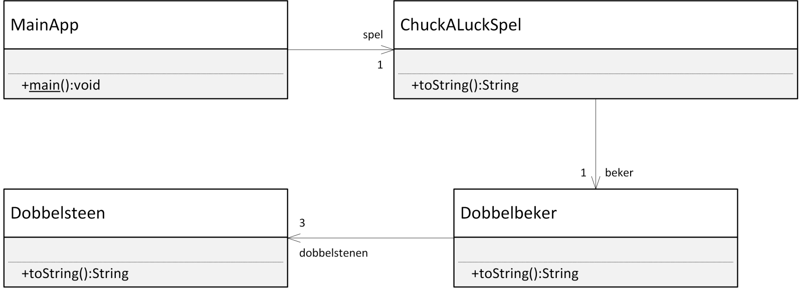

Les 7 - Voorbereiding (V7)
===

# Theorie

## Screencast onderwerp 4.2 -- 4.4 van Processing naar Java

### Onderwerp 4.2

<https://www.youtube.com/watch?v=Ub-0Pa5B1Lw&list=PLpd9jJvk1PjnMmrtlNeOzviLhJolx0_oi&index=2>

 
#### Onderwerp 4.3

<https://www.youtube.com/watch?v=guHGz_a1Z0w&list=PLpd9jJvk1PjnMmrtlNeOzviLhJolx0_oi&index=3>
 

#### Onderwerp 4.4

<https://www.youtube.com/watch?v=XQltRh1ba0g&list=PLpd9jJvk1PjnMmrtlNeOzviLhJolx0_oi&index=4>


## Boek

### Hoofdstuk 2

2.8 (pagina 68 t/m 70)

### Hoofdstuk 6

6.12 (pagina 239 t/m 242)


## Processing library importeren in IntelliJ / Eclipse 

Om de Processing klassen te kunnen gebruiken in  IntelliJ of Eclipse, zul je deze eerst moeten importeren. Hoe je dit kan doen staat in het document **Gebruik van Processing in Eclipse en IntelliJ.docx**, te vinden op Onderwijs Online.


# Opgave V7.1 - Klok in Eclipse

## V7.1 A

Zet alle klassen uit de `KlokApp` in Processing om naar Javacode in IntelliJ / Eclipse.

(De Processing code staat op Onderwijs Online, zie Les 5: KlokApp.zip)

## V7.1 B

Zorg ervoor dat de klasse `Klok` geen instantievariabelen `x, y, hoogte` en `breedte` meer heeft. Maak in `Klok` wel getters en setters voor `x, y, hoogte` en `breedte` en zorg ervoor dat in die getters en setters de `urenTeller` en `minutenTeller` gebruikt worden om de juiste waarde terug te geven en aan te passen.


# Opdracht V7.2 - Klassediagram Chuck-a-luck

## Spelbechrijving

Beschouw de volgende eenvoudige versie van het spel Chuck-a-luck: Per ronde zet je een bedrag in op een geluksgetal van 1 tot 6 en vervolgens gooi je drie dobbelstenen met behulp van een dobbelbeker. Als geen van de dobbelstenen dit geluksgetal aangeeft, dan ben je je inzet kwijt. In alle andere gevallen wordt uitbetaald afhankelijk van het aantal dobbelstenen dat het voorspelde aantal ogen weergeeft:

| Overeenkomende dobbelstenen |Uitbetaling|
|-----------------------------|-----------|
| 1 (een Single)              | 1:1       |
| 2 (een Double)              | 2:1       |
| 3 (een Triple)              | 10:1      |

## Technische specificatie

#### Klassen

De hele applicatie bestaat uit vier klassen: Dobbelsteen, Dobbelbeker en ChuckALuckSpel en MainApp. Zie onderstaande klassendiagram (meeste methoden en instantievariabelen zijn weggelaten).



#### MainApp

De `MainApp` fungeert als een test voor de andere drie klassen. Hieronder is een mogelijke implementatie gegeven van de `MainApp`.

```java
public class MainApp {

   public static void main(String[] args) {
   
      ChuckALuckSpel spel = new ChuckALuckSpel(100);
      
      spel.speelRonde(3, 5);
      System.out.println(spel);
      
      spel.speelRonde(3, 20);
      System.out.println(spel);
      
      spel.speelRonde(4, 10);
      System.out.println(spel);
   }
}
``` 

Deze code levert onderstaande uitvoer in de console:

```
Ronde: 1
geluksgetal: 3
worp: 1 6 1
saldo: 95
---------------
Ronde: 2
geluksgetal: 3
worp: 2 6 5
saldo: 75
---------------
Ronde: 3
geluksgetal: 4
worp: 5 3 4
saldo: 85
---------------
```

## 

## Opgave

Maak het klassendiagram af door in de drie klassen: `ChuckALuckSpel`, `Dobbelbeker` en `Dobbelsteen` alle ontbrekende instantievariabelen en methoden toe te voegen zodat ChuckALuck gespeeld kan worden op basis van bovenstaande beschrijving.
Probeer geen getters en setters te declareren tenzij je denkt dat je echt niet zonder kan in deze situatie.

#### Hint

Je hoeft nog geen code te schrijven, dat doen we in de les.
