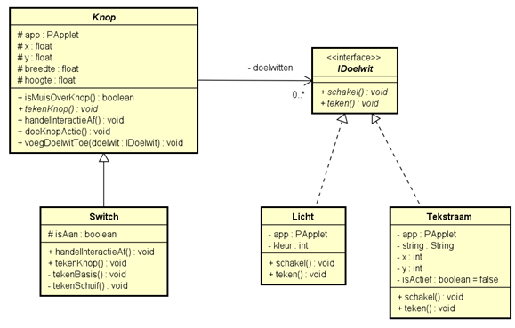
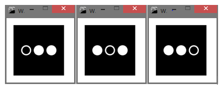
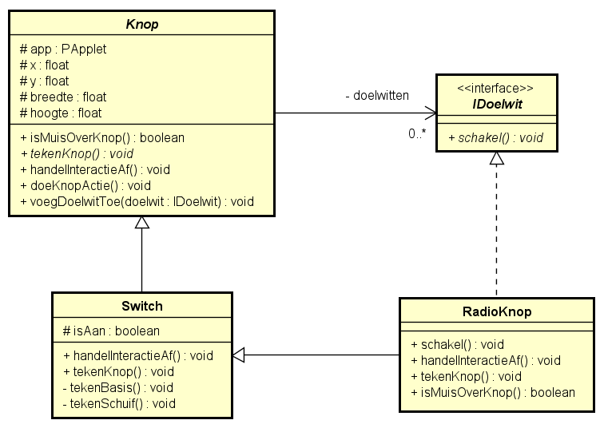

Les 13 - Lesprogramma (L13)
===


# Opgave L13.1 - Meerdere doelwitten

We starten met een programma dat lijkt op het programma uit de screencast, maar met een paar wijzigingen. Je vindt de startcode op OnderwijsOnline en het klassendiagram staat hieronder.



Een knop kan nu meerdere `IDoelwitten` bevatten. Zodra er op de knop geklikt wordt, moeten alle gekoppelde doelwitten de methode `schakel` aanroepen.

De klasse `Tekstraam` plaats een tekst op het scherm als de methode `schakel` aangeroepen wordt.

## L13.1 A

Implementeer deze klassen en laat zien dat het programma werkt door een instantie van `Licht` en `Tekstraam` aan een instantie van `Switch` te koppelen in het hoofdprogramma. Je kunt om te testen de gegeven code in de klasse `KnoppenApp` gebruiken: hierin wordt een switch gemaakt waaraan een instantie van `Licht` en een instantie van `Tekstraam` worden gekoppeld.

## L13.1 B

Voeg een tweede switch toe waaraan dezelfde instantie van `Licht` is gekoppeld als aan de switch uit opgave A. Wat voor probleem kan nu optreden?

## L13.1 C

Laat de klasse `Switch` de interface `IDoelwit` implementeren. Wat kun je nu realiseren?


# Opdracht L13.2 - Radioknoppen

In deze oefening gaan we de implementatie van een interface combineren met een associatie van dezelfde interface binnen één klasse. We bouwen verder op de code van de vorige opdracht.*

Gekoppelde radioknoppen zijn knoppen, waarvan er maar één tegelijkertijd aan kan staan.

Zie onderstaande screenshots voor een voorbeeld. Je ziet hierop steeds drie radioknoppen.



In deze opdracht ga je de klasse `Radioknop` implementeren door deze te laten erven van `Switch` en de interface `IDoelwit` (zie vorige opgave) te laten implementeren. Zie onderstaand klassendiagram.



## L13.2 A

Leg uit welke mogelijkheden `Radioknop` krijgt door:

-   te erven van `Switch`
-   de interface `IDoelwit` te implementeren

## L13.2 B

Implementeer de klasse `Radioknop` volgens bovenstaande specificatie. De `teken()` methode van `IDoelwit` heb je in deze opgave niet nodig en kun je weglaten. Voor de methoden `tekenKnop` en `isMuisOverKnop` in deze klasse, kun je onderstaande code gebruiken

```java
@Override
public void tekenKnop() {
   app.ellipseMode(PApplet.CENTER);
   app.noStroke();
   app.fill(255);
   app.ellipse(x, y, breedte, hoogte);

   if (isAan) {
      app.fill(0);
      app.ellipse(x, y, breedte - breedte / 4, hoogte - hoogte / 4);
   }
}

@Override
public boolean isMuisOverKnop() {
   if (PApplet.dist(app.mouseX, app.mouseY, x, y) < breedte / 2) {
      return true;
   }
   else {
      return false;
   }
}
```

## L13.2 C

Test de klassen in het hoofdprogramma door een `ArrayList` met drie instanties van `RadioKnop` te maken. Uiteraard moet je voor elke radioknop de andere twee radioknoppen als doelwit toevoegen. Zorg dat er in totaal drie radioknoppen in het hoofdprogramma zijn die allen aan elkaar gekoppeld zijn (d.w.z. dat van elk van de drie radioknoppen de twee andere radioknoppen als doelwit zijn toegevoegd).