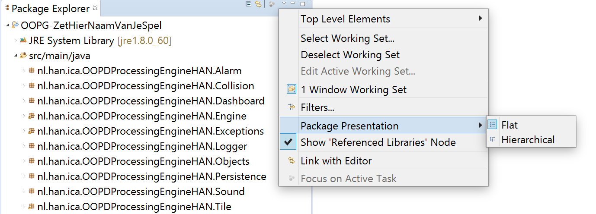

Les 15 - Voorbereiding (V15)
===

# Vragen stellen

In de les gaan we de oefentoets maken en is er ruimte voor het beantwoorden van allerhande vragen over OOPD (ter voorbereiding op de echte toets). Om het behandelen van de vragen zo nuttig mogelijk te maken, voer je de volgende opdracht uit:

-   Bereid *minimaal* 3 vragen voor over de OOPD-stof die je graag behandeld wil hebben in de les. Maak de vragen zo concreet mogelijk. Lever ze bij je docent in op de gebruikelijke manier.

# Voorbereiden voor eindopdracht

Maak een start met de voorbereiding, tijdens de les ga je hier mee verder.
Voor de eindopdracht maken we gebruik van een door AIM ontwikkelde game engine Yaeger (<https://github.com/han-yaeger>)
Ga aan de slag met de tutorial, <https://han-yaeger.github.io/yaeger-tutorial/introduction.html>, om de game-engine in Eclipse of IntelliJ op te zetten en vervolgens te leren hoe je hiermee je game kunt ontwikkelen.

Lees ook de manual door:
<https://han-yaeger.github.io/yaeger/book/>

Om een idee te krijgen welke features er allemaal in Yaeger zitten kun je de Showcase bekijken:
<https://github.com/han-yaeger/yaeger-showcase>

Hou hier rekening mee wanneer je een eigen game gaat bedenken. Heb je features nodig die niet in de showcase voorkomen, check dan even bij je docent of het mogelijk is. Yaeger is nog steeds in ontwikkeling en er worden voortdurend nieuwe features toegevoegd.

Als de packages in Eclipse er zo uitzien als in de afbeelding hieronder (alle packages onder elkaar) en je dat onprettig vindt, kun je ervoor kiezen om de manier waarop packages worden weergegeven aan te passen. Doe dat door op het kleine naar beneden wijzende pijltje boven de mappenstructuur te klikken, te kiezen voor "Package representation" en vervolgens "Hierarchical".

