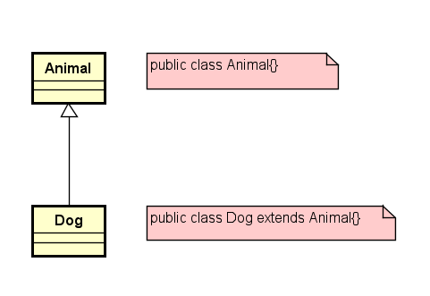

In deze les komt een van de belangrijkste concepten van object georienteerd programmeren aan bod, n.l. overerving (engels: Inheritance). Een klasse kan eigenschappen en gedrag (attributen en methodes) erven van een andere klasse. De klasse die erft wordt de subklasse genoemd, de klasse waarvan wordt geërfd wordt de superklasse genoemd.

In een klassendiagram wordt een overervingsrelatie als volgt weergegeven. Let hierbij op de pijl met de open pijlpunt, deze wijst van subklasse naar superklasse. In UML is het type pijl dat je gebruikt erg belangrijk, let er dus goed op dat je steeds de juiste pijl tekent en op de juiste manier interpreteert.

