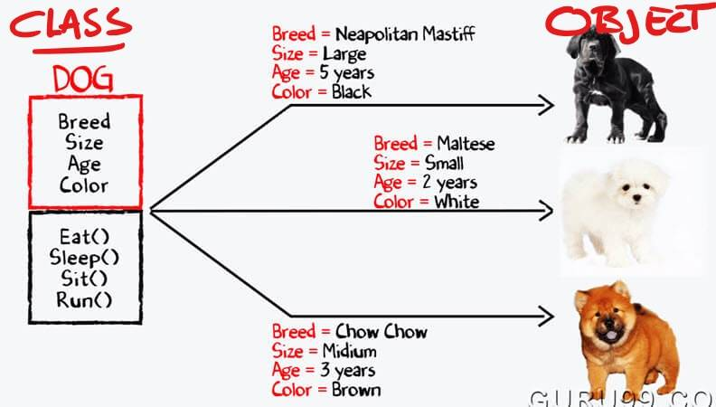

Naast dat een object allerlei eigenschappen bezit, kan het ook bepaald gedrag (behaviour) vertonen. Dit wordt ook gedefinieerd in de Klasse en wel als methoden.
Zo kan een object van het type `Dog`, eten, slapen, opzitten en rennen.

©GURU99.com