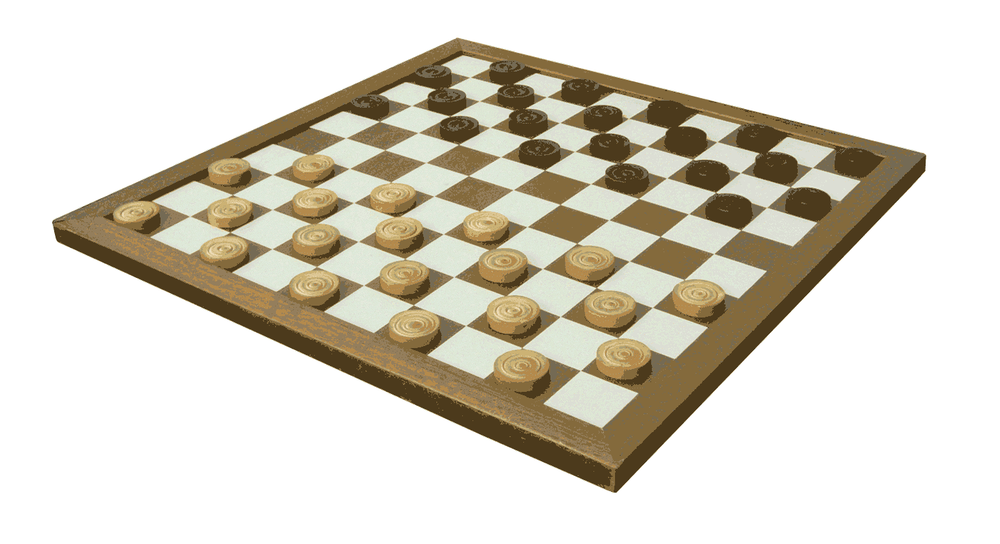
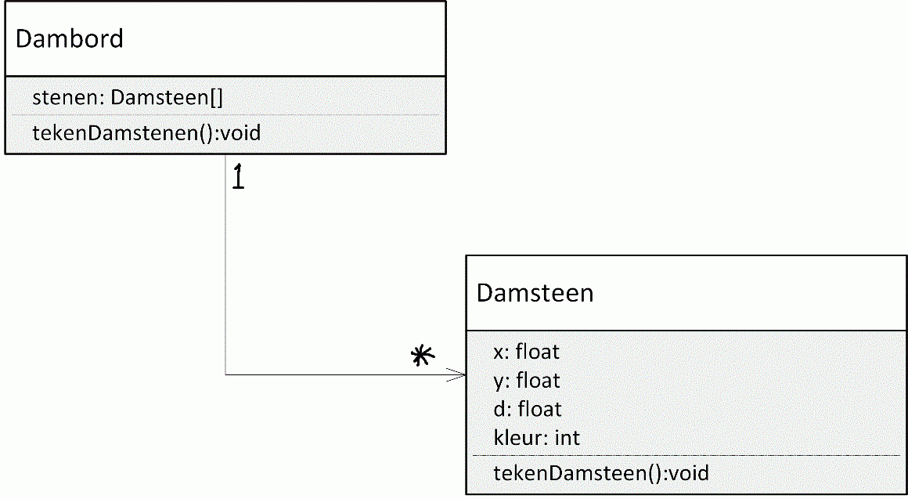

Tot nu toe hebben we het gehad over 1 enkel object die we gebruikt hebben om wat simpele functionaliteiten te realiseren.

In een complexer object georienteerd systeem werken verschillende objecten samen om bepaalde functionaliteit te realiseren. Hiervoor moet er enige 'interactie' tussen de objecten zijn. Voor die interactie moet het ene object het andere object natuurlijk wel 'kennen'. Eén manier hiervoor is om een object als attribuut te definiëren van het andere object.               

 

Het `Dambord` heeft een 1 op veel relatie met `Damsteen`