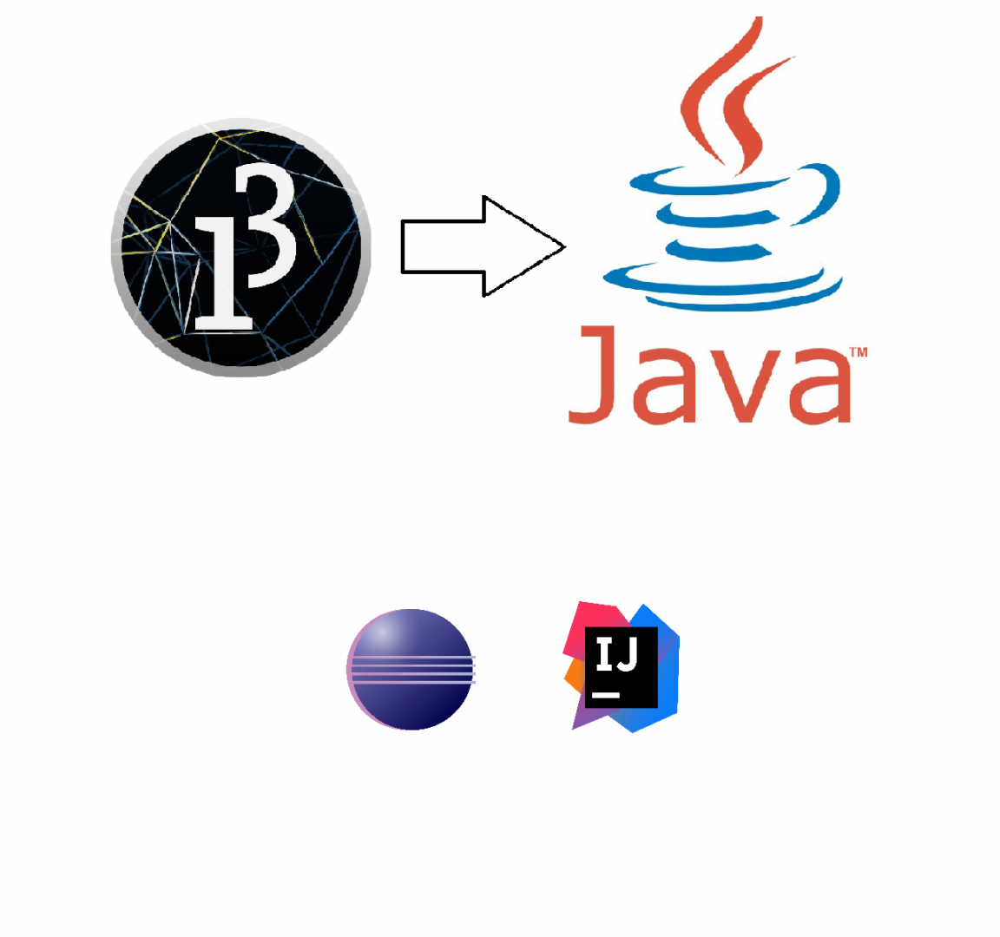

n deze les maken we de stap van Processing naar Java en gaan we aan de slag met een geavanceerdere IDE. In de screencasts en het materiaal wordt gebruik gemaakt van Eclipse. Dus mocht je het prettig vinden om meer voorbeeld te hebben, kies dan Eclipse. Echter is IntelliJ IDEA tegenwoordig de standaard in de industrie en heeft iets meer handige features ter ondersteuning van de developer, dus installeer bij voorkeur deze IDE..

Verder gaan we in de les de oefentoets maken en bespreken.

