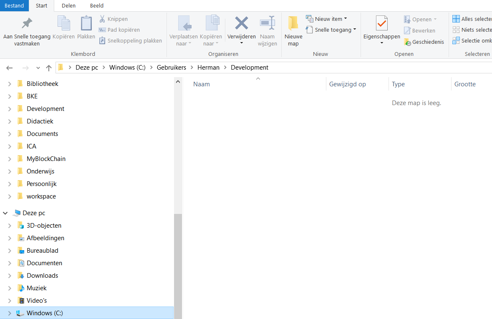
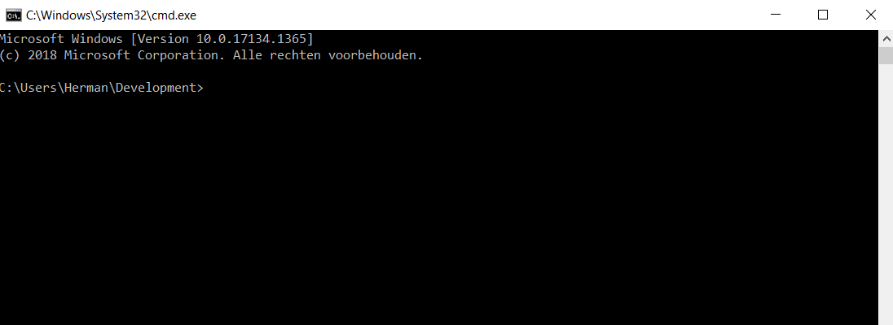
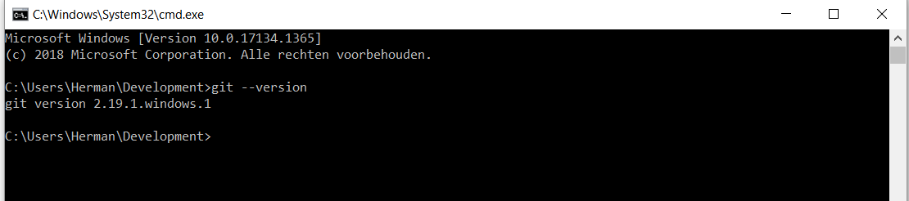
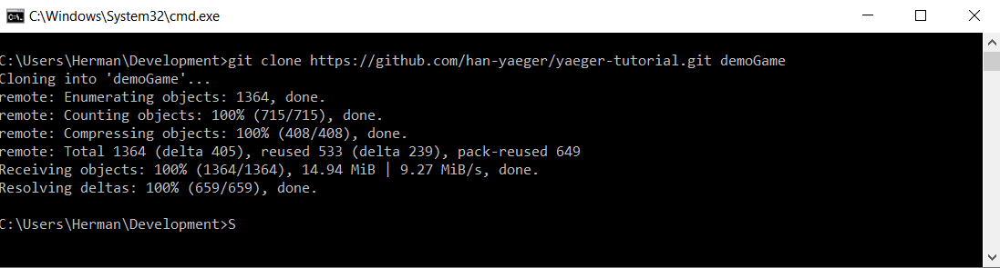
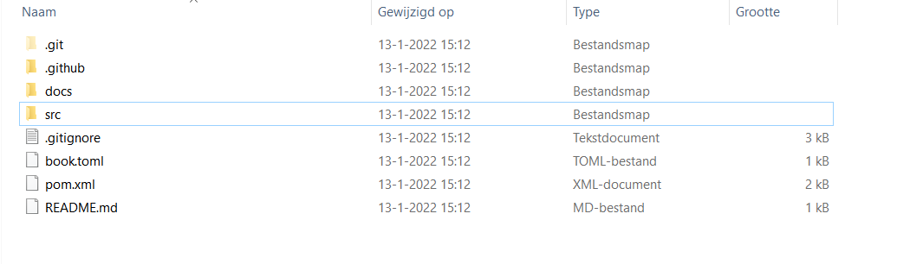

# Aan de slag met Git en GitHub

Het uitgangspunt van deze tutorial is dat je `Git` succesvol hebt geïnstalleerd.

Je kunt Git downloaden via: <https://git-scm.com/downloads>.

De installatie instructies vindt je hier: [Git - Installing Git (git-scm.com)](https://git-scm.com/book/en/v2/Getting-Started-Installing-Git)

**Terminologie**
| Term | Betekenis |
| --- | --- |
| Git | Versiebeheer software |
| GitHub | Cloud storage die geïntegreerd is met Git |
| Repository | De plek waar jouw bestanden staan we maken hierbij onderschei tussen de locale repository op je eigen computer en de remote reposity op GitHub |

Er is ontzettend veel materiaal te vinden op internet over werken met Git en GitHub. Mocht je meer informatie willen dan is google-en een goede eerste stap.

Enkele voorbeelden:

[Coding Train: Git and GitHub for Poets](https://www.youtube.com/playlist?list=PLRqwX-V7Uu6ZF9C0YMKuns9sLDzK6zoiV)

Een serie video tutorials van Daniel Shiffman, die je wellicht nog wel kent van de Processing filmpjes bij SPB.

Verder zijn de volgende tutorials aan te bevelen:

-  [Learn Git In 15 Minutes - YouTube](https://www.youtube.com/watch?v=USjZcfj8yxE)

-  [Git & GitHub Crash Course For Beginners - YouTube](https://www.youtube.com/watch?v=SWYqp7iY_Tc)

-  [Git Tutorial for Beginners - Git & GitHub Fundamentals In Depth - YouTube](https://www.youtube.com/watch?v=DVRQoVRzMIY)

In dit document worden Git en GitHub uitgelegd in de context van de game die jullie gaan maken met behulp van Yaeger.

# Lokale Git repository maken en de Game-engine files hierin plaatsen

Een Git repository opzetten kan op verschillende manieren. Hieronder is een van die manieren opgeschreven. Dit is dus een manier en niet dé manier.

Doe deze stappen eerst voor 1 teamlid, het andere teamlid kan vervolgens op een eenvoudigere manier zijn/haar repository opzetten.

De stappen gaan voornamelijk via het zogeheten command-window (cmd). Je kunt met Git werken door enkel via de command window Git-commando's te geven. Maak je geen zorgen, in deze workshop gebruiken we de command window alleen om Git op te zetten. Git is namelijk ook standaard al geïntegreerd met Eclipse en IntelliJ en je kan tijdens het bouwen van je game van je IDE gebruik maken om git commando's uit te voeren.


## Stap 1: Bepaal waar je je lokale repository/project wilt hebben staan

Open de folder waar je je project wilt opslaan



## Stap 2: Controle of Git goed is geïnstalleerd

Open een command-window in deze folder. Die doe je door in de adres balk `cmd` te typen (rode markering)

Er verschijnt nu een command-window:



Om te controleren of je git correct hebt geïnstalleerd kun je hier typen:

```
git --version
```

Als er nu een regel verschijnt met de versie van git, dan is git goed geïnstalleerd



## Stap 3: Clone tutorial

Geef nu het commando zoals in de tutorial vermeld, met een eigen naam voor je project (in mijn geval noem ik mijn project '**demoGame',** jullie zetten hier de naam van jullie game):

git clone https://github.com/han-yaeger/yaeger-tutorial.git demoGame

Als het goed is verschijnt de volgende output:



Binnen de directory is een nieuwe project directory (hier 'demoGame') aangemaakt en hier is de code van de game-engine neergezet:



Je hebt nu succesvol, **lokaal**, een git-repository aangemaakt. Dit betekent dat van elke file in deze directory de versies worden bijgehouden. Nou ja, niet van alle. In de file .**gitignore** zie je welke bestanden niet worden meegenomen in het versiebeheer (bij naam genoemd, maar meestal met alleen extensie). Deze lijst kun je zelf naar believen aanvullen.