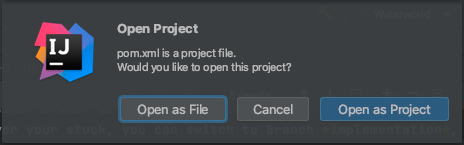
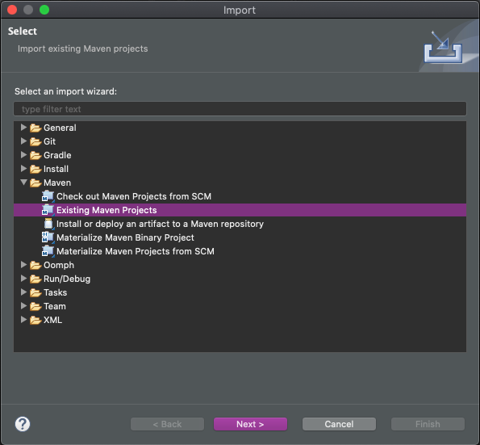
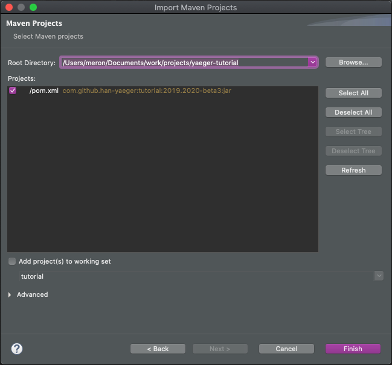

# Importeer het project in je favoriete IDE

(bron: [Yaeger tutorial])

De Yaeger tutorial is een zogeheten Maven project. Maven is een build tool die veel gebruikt wordt in het werkveld. Wat een buildtool (in dit geval Maven) precies is en doet, gaat voor het vak OOPD te ver om helemaal uit te leggen. In de hoofdfase wordt hier dieper op in gegaan bij het vak DEA in het OOSE semester.

Aangezien alle moderne IDE\'s een Maven project kunnen importeren , maakt het niet uit welke je gebruikt. In deze tutorial richten we ons op de twee meest populaire onder Java-ontwikkelaars: JetBrains IntelliJ en Eclipse.

## Importeren van project in IntelliJ

1.  Select *File \> Open\...*

2.  Navigeer in het import window naar de projectmap. Merk op dat deze map een pom.xml bestand bevat. Selecteer dit pom.xml bestand en druk op *Openen*.

3.  IntelliJ zal merken dat je een pom.xml bestand opent en zal vragen of het nodig is om het hele project te openen:

> 

Selecteer **Open as Project**

## Importeren van project in Eclipse

1.  Selecteer *File \> Import\...*

2.  In het **import window**, selecteer  *maven*, selecteer  *Existing Maven Projects*, en klik *Next:*

> 

3.  Klik *Browse* en selecteer de project directory. Merk op dat deze directory een pom.xml file bevat:

> 
>
> Selecteer de pom.xml file en klik *Finish*

[Yaeger tutorial]: https://han-yaeger.github.io/yaeger-tutorial/import.html#importing-the-maven-project-into-your-favourite-ide