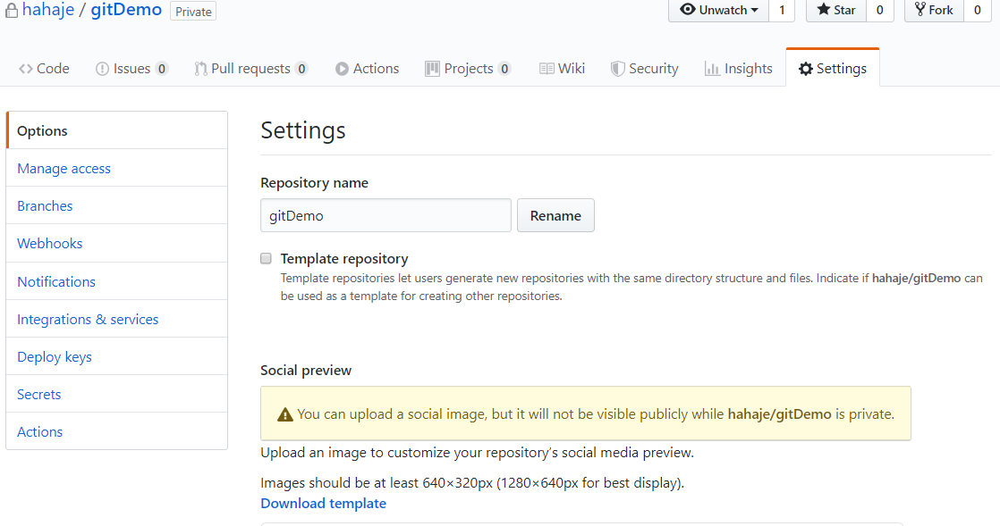
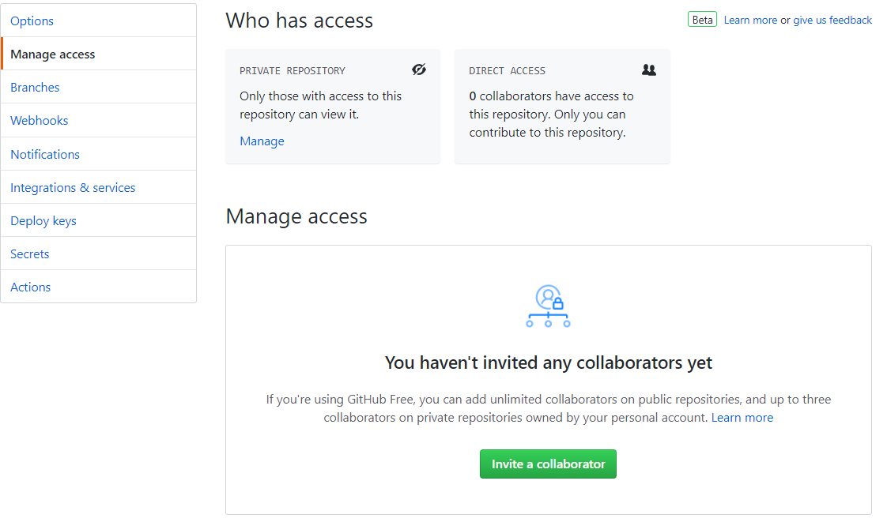
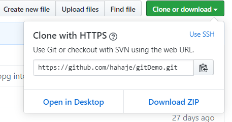
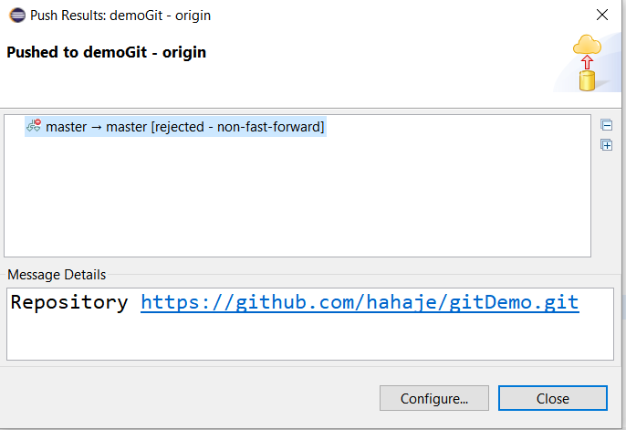
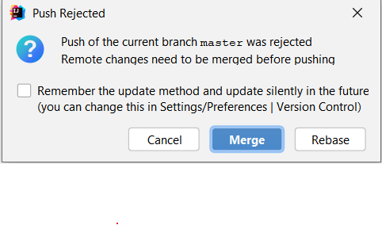
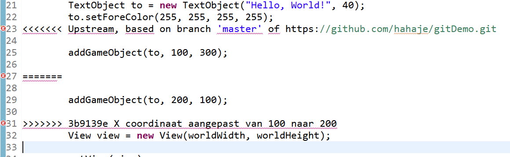
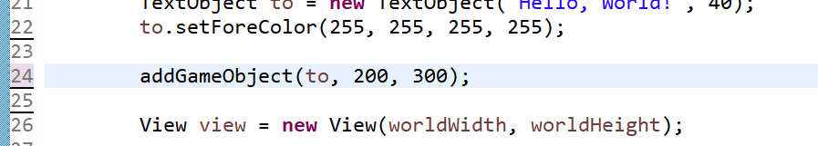
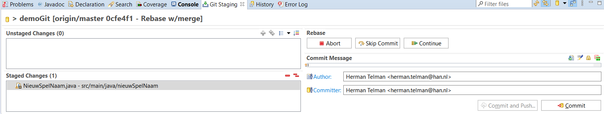
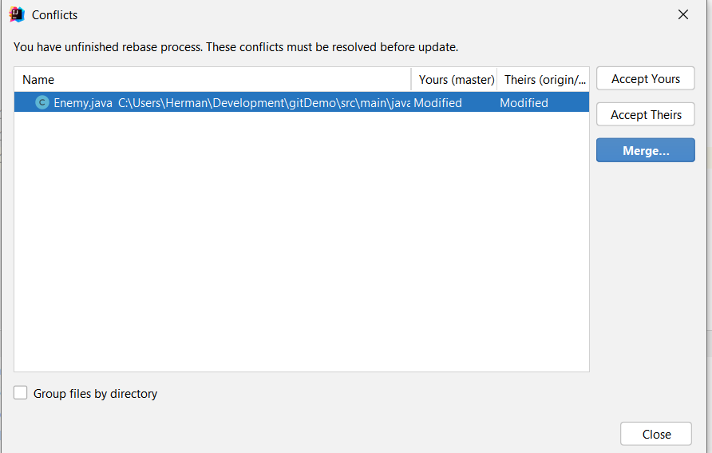
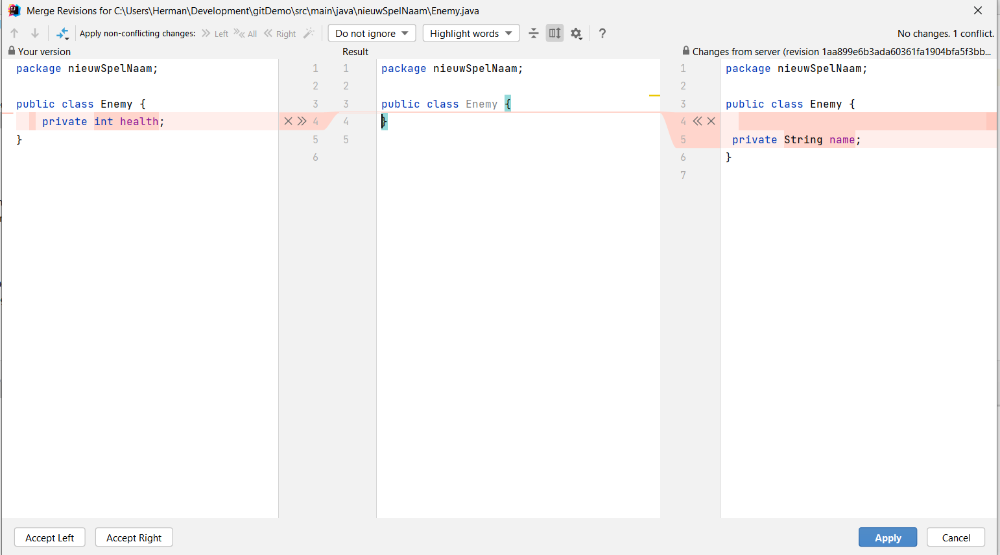

# Samenwerken aan de game, een simpele workflow

Het wordt tijd dat het andere teamlid ook betrokken wordt bij het bouwen van de game.

Een paar simpele stappen zorgen ervoor dat ook hij/zij snel aan de slag.

## Beginnen met samenwerken

Het teamlid dat de GitHub repository heeft opgezet moet de ander uitnodigen om een bijdrage te gaan leveren aan de remote repo.

Ga hiervoor naar GitHub selecteer de repo van je spel en ga naar het laatste tabblad 'Settings'

Selecteer hier 'Manage access'

Klik op de knop 'Invite a collaborator'. In het hierop volgende scherm kun je je teamlid opzoeken op GitHub (hij/zij moet dus wel al een account hebben).

Selecteer je teamlid en klik op de knop "Add \<naam teamlid\> to \<naam repo\>".

Degene krijgt dan een mailtje, waarin bevestigd moet worden.

Wanneer dit gebeurd is, gaat degene naar GitHub en zoekt de repo op.

Kopieer de URL. En volg in feite weer stap 1 uit hoofdstuk 1.

Open een command window op plek waar je de files op je computer wilt hebben staan

en geef weer het clone commando met de gekopieerde URL

git clone \<gekopieerde URL\> demoGit

In plaats van demoGit natuurlijk de naam zoals je je repo wilt noemen of hebt genoemd.

In principe zouden de verwijzingen naar de remote repo nu al goed moeten zijn. Je kan dit even checken

met

git remote -v

of dit ook zo is.

Zet ook nog even de volgende globale variabelen in git:

git config \--global user.name \"voornaam achternaam\"

git config \--global user.email jouwnaam\@student.han.nl

Deze lokale repo vervolgens importeren in Eclipse zoals in hoofdstuk 2 stap 3.

## Werkwijze

Nu er meerdere teamleden wijzigingen gaan aanbrengen aan hun lokale master branch en deze willen pushen naar de remote master branch, wordt de workflow iets gecompliceerder dan hoe het in het vorige hoofdstuk 3 is beschreven.

Ieder teamlid volgt de volgende werkwijze:

1.  Voor je begint met het wijzigen of toevoegen van source-code doe je eerst een pull van de remote repo naar je lokale repo.

-   Eclipse: Rechtsklik project en kies Team \> Pull...

-   IntelliJ: Rechtsklik project en kies Git \> Pull...

2.  Nadat je klaar bent met coderen en testen, en je ervan overtuigd bent dat je functionaliteit goed werkt, kun je je werk Commiten en Pushen naar de remote repo

-   Eclipse: Rechtsklik project en kies Team \> Push. Het Git staging window verschijnt onder in je scherm. Kijk hierin of al je gewijzigde files in de Unstaged Changes box staan. Voeg ze toe aan de Staged Changes box. Vul een duidelijk commit message in kies voor Commit and Push...

-   IntelliJ: Rechtsklik en kies voor Git \> Push.

3.  Als alles goed gaat krijg je in Eclipse een window te zien dat er ongeveer als volgt uitziet:

![][18]

In IntelliJ krijg je een melding rechts onder in het scherm:

Helaas gaat het niet altijd zo soepel, en kun je tegen een merge-conflict aanlopen. Hoe daar mee om te gaan lees je in de volgende paragraaf.
 
## Merge-conflicten oplossen

Ieder teamlid gaat afzonderlijk aan een stuk functionaliteit werken. De wijzigingen die logischerwijs bij dit stuk functionaliteit horen worden samen in 1 commit gestopt. Nu kan het voorkomen dat je teamlid een file al eerder heeft aangepast en al naar de remote master repo heeft gepushed. Vooral in een kleine code-base als het OOPD beroepsprodukt kan dit vaak voorkomen. Als jij nu klaar bent en je wijziging wilt pushen met naar de remote master repository, zul je merken dat de push niet uitgevoerd wordt. De volgende melding verschijnt:

In Eclipse:

In IntelliJ:

Dit is een zogeheten merge-conflict. Jouw wijzigingen dreigen de wijzigingen van je teamlid te overschrijven. Dit wordt voorkomen door git en je moet dit gaan oplossen. Geavanceerde IDE's zoals IntelliJ en Eclipse helpen je hierbij en maken dit proces makkelijker.

Ik zal dit illustreren aan de hand van concrete voorbeelden.

### Merge conflicten oplossen in Eclipse

Neem als voorbeeld de file uit hoofdstuk 3: NieuwSpelNaam.java

Stel dat de een van de teamleden de volgende regel

addGameObject(to, 100, 100);

heeft veranderd in:

addGameObject(to, 100, 300);

en gecommit and gepushed met commit message: "Y coördinaat aangepast van 100 naar 300."

Deze commit en push is geslaagd omdat hij het eerst was.

(NB: het is natuurlijk niet de bedoeling dat iedere kleine wijziging apart wordt gecommit, maar dit is even een voorbeeld)

Jijzelf wil dezelfde source-file wijzigen, de regel

addGameObject(to, 100, 100);

moet Worden

addGameObject(to, 200, 100);

En je wilt dit committen en pushen ovv "X coördinaat aangepast van 100 naar 200"

De push zal in dit geval niet doorgaan, omdat dit de voorgaande wijziging weer zou overschrijven. Er volgt een zogeheten merge-conflict

Om dit op te lossen: rechtsklik project en kies Team \> Pull

Er volgt een info scherm dat dit niet lukt.

Klik dit scherm weg.

Er wordt automatisch de source file getoond met daarin aangegeven tussen \<\<\<\<\<\<\<\< en \>\>\>\>\>\>\>\> waar de verschillen in zitten.

Aan jullie de taak om te bepalen wat het uiteindelijk moet worden

Aan jullie de taak om te bepalen wat het uiteindelijk moet worden.

Je kunt in dit scherm gewoon editen en waarschijnlijk moet het eindresultaat zoiets worden:

In het staging tabblad, de Unstaged changes weer toevoegen aan de Staged changes en vervolgens op Continue klikken

Jouw lokale master branch bevat nu de 'waarheid' en deze moet gepushed worden naar de remote master branch: Rechtsklik project en kies Team \> Push to Upstream.

Alles zou nu weer goed moet staan.

### Merge conflicten oplossen in IntelliJ

In IntelliJ verloopt dit proces iets anders, en naar mijn mening iets makkelijker.

Stel ik heb aan de klasse Enemy een nieuw attribuut *health* toegevoegd. Mijn collega was iets eerder met zijn wijzingen naar remote pushen en hij/zij had aan dezelfde klasse ook een nieuw attribuut toegevoegd, namelijk *name*. Mijn push zou dus deze wijziging overschrijven als dit zonder meer doorgelaten zou worden.

In het scherm waarin vermeld wordt dat de Push ge-reject is, kun je voor optie Merge kiezen:![][31]

Hierna verschijnt het volgende window.

Als je zeker van je zaak bent kun je voor Accept Yours of Accept Theirs kiezen (hierdoor wordt de andere zijn wijziging verwijdert danwel de jouwe).

Het advies is om altijd voor Merge.. te kiezen. Hier heb je volledige controle en zicht op de wijzigingen.

Je komt dan in het volgende scherm:

Links zie je jouw changes, rechts de code zoals de op de remote repository staat, in het midden komt het resultaat van de merge. Je zult nu samen moeten bepalen wat de juiste versie moet worden. In dit geval lijkt het me logisch dat beide attributen in de klasse opgenomen moeten worden. Klik hiervoor op gehighlighte regels ( op X\>\> en \<\<X). Je zult zien dat in het midden dan een combi van beide files komt te staan. Klik vervolgend op Apply.

Wil je de linker danwel de rechter versie behouden, klik dan op Accept Left resp. Accept Right.

Na de keuze voor Apply, Accept Left of Accept Right, wordt de push meteen uitgevoerd en zal deze keer wel slagen.

