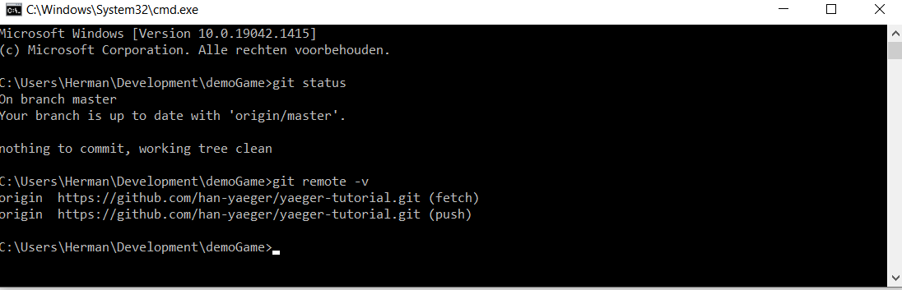
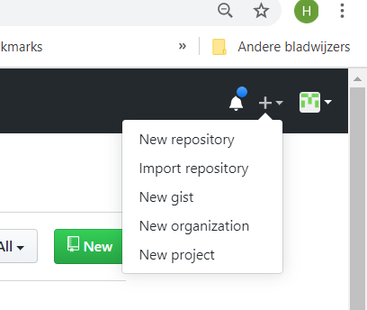
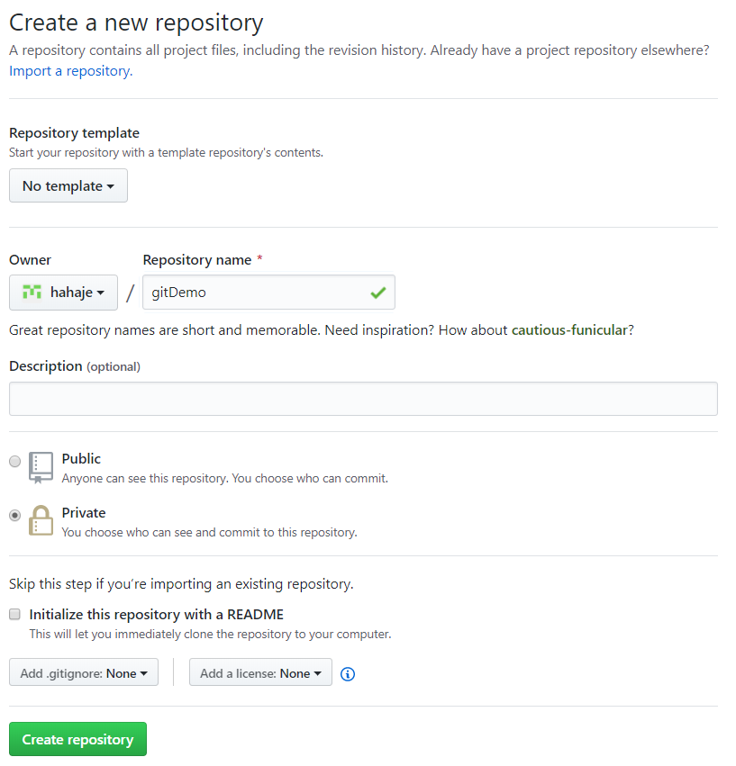
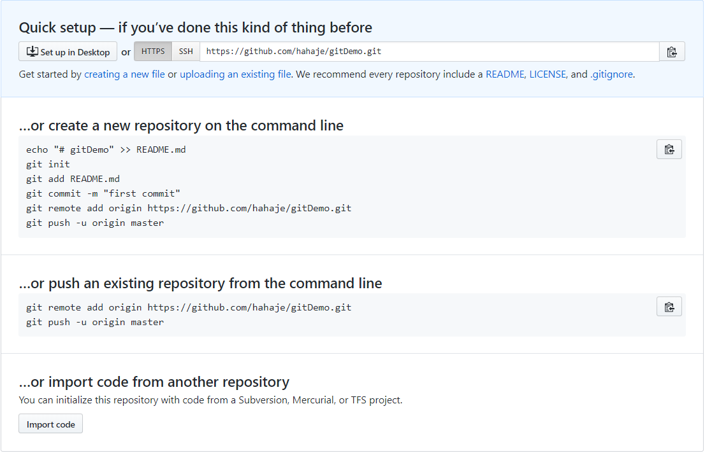
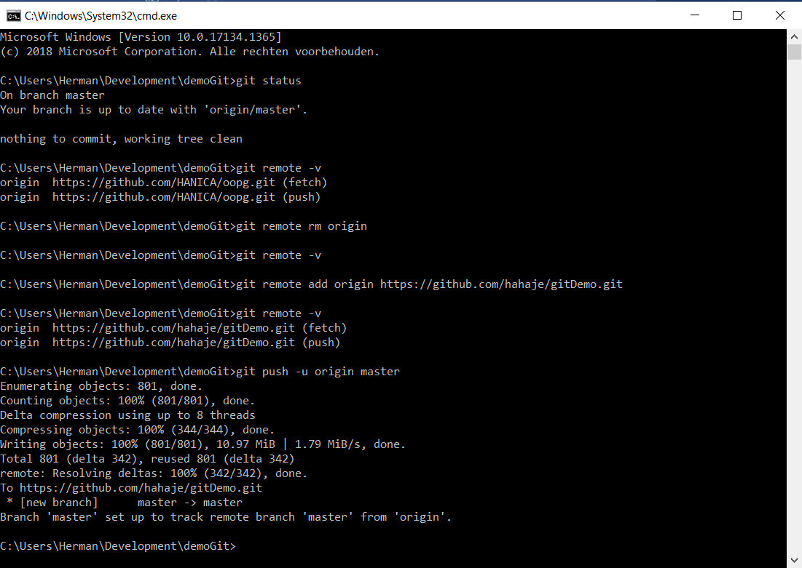
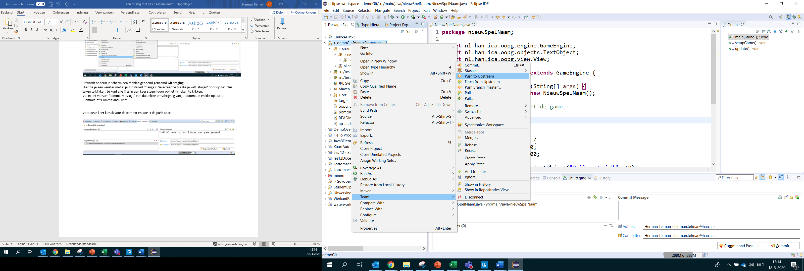
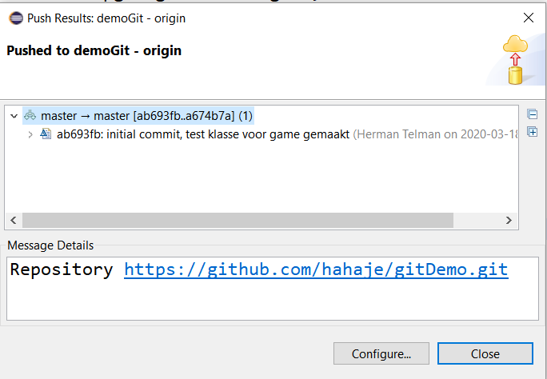
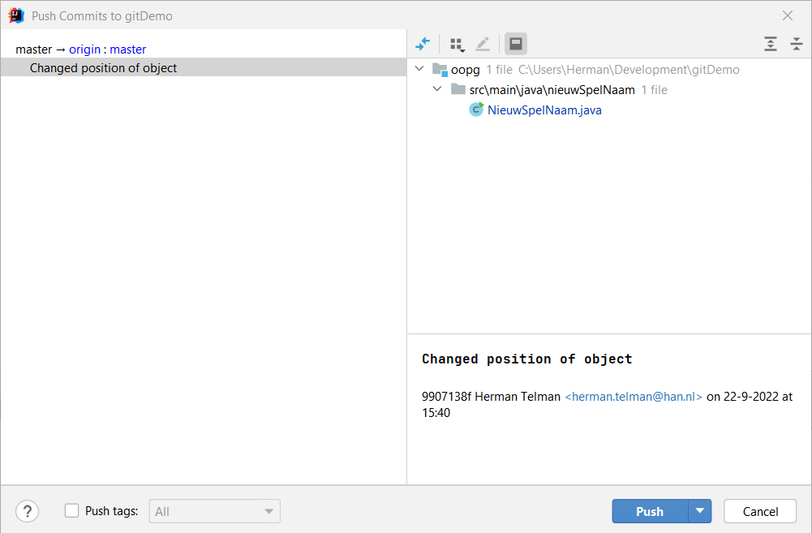
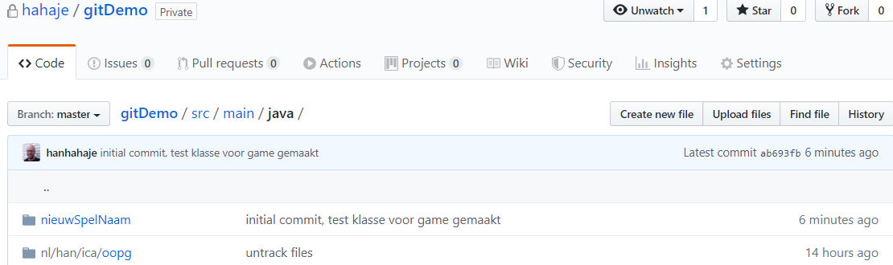

# Starten met samenwerken aan de game m.b.v. git en GitHub

Leuk hoor, dat nu ieder teamlid een lokale repository heeft. Maar hoe kunnen we nu samen werken aan dezelfde game en makkelijk onze wijzigingen delen?

Het antwoord hierop is door gebruik te maken van een **remote repository.** Dit is een repository die op een server staat (vaak in de cloud) en in ons geval is dat GitHub, omdat dit zo lekker is geïntegreerd met git.

In feite is je lokale repository al gekoppeld met een remote repository, namelijk die waar je de source-files voor de game-engine vandaan hebt gehaald. Hier heb je in feite niets aan, jullie willen niet gaan samenwerken aan de game engine zelf, maar aan een hele nieuwe eigen game. Hiervoor moeten jullie een eigen remote repository maken op GitHub en jullie lokale repository hiernaar linken.

Laten we even kijken wat we nu hebben:

Via git status kun je de status van je git repository opvragen (duh...)

De melding verschijnt dat onze lokale repository up to date is met de remote repository aangeduid met origin/master

Met git remote -v kun je zien aan welke remote repositories onze lokale repository is gekoppeld.

Je ziet dat die nog gekoppeld is aan de repository van de Game-engine. Dat is niet wat we willen, we willen natuurlijk een remote repository van onze eigen game. Laten we dat gaan fixen.

## Stap 1: Maak een GitHub account aan

Maak beide een account op GitHub <https://github.com/>, mocht je die nog niet hebben. Ik ga ervan uit dat dat lukt zonder er hier veel aandacht aan te besteden.

## Stap 2: Maak een nieuwe repository aan op GitHub

**Eén** van de teamleden maakt een nieuwe repository aan op GitHub.

Klik hiervoor op het + teken in de rechterbovenhoek, en kies voor 'New repository'

Het volgende scherm verschijnt. Vul de naam van je repo in (in mijn geval gitDemo), maak er een **private** repo van en vink het aanmaken van een README uit.

  
Na het klikken op 'Create repository' verschijnt het volgend info-scherm. We gaan de suggestie in de rode box gebruiken.

Ga weer terug naar de command window, of open hem opnieuw in de directory waar je de game-engine files hebt neergezet en waar je je game-files aan wilt gaan toevoegen.

Eerst gaan we de huidige koppeling met de remote repo verbreken. Dit kun je doen door middel van het commando git remote rm origin. De rm staat voor remove.

De check git remote -v zou nu geen resultaat meer op moeten leveren.

Voer vervolgens de gesuggereerde commando's na elkaar uit, dus:

git remote add origin <https://github.com/hahaje/gitDemo.git>

(Let op: doe dit voor je eigen repo, niet deze regel kopiëren en uitvoeren)

en

git push -u origin master

Git gaat nu je lokale repo kopiëren naar de door jou net aangemaakte remote repo, dit duurt heel even.

Als je je remote repo op GitHub vervolgens bekijkt, zul je zien dat hier alle files van jouw game in staan. 

## Stap 3: Credentials opgeven

Zet ook nog even de volgende globale variabelen in git:

git config \--global user.name \"voornaam achternaam\"

git config \--global user.email jouwnaam\@student.han.nl

Deze worden meegegeven als je iets naar de remote repository overzet. Zo is altijd terug te vinden wie wat heeft gedaan.

## Remote repository updaten met de lokale wijzigingen

Wanneer je lokaal in je eigen omgeving wijzigingen hebt aangebracht en deze hebt gecommit (snapshot gemaakt). Dan wil je deze natuurlijk ook in de remote repository doorvoeren, zodat teamleden deze wijzigingen ook kunnen zien. Hiervoor moet je na het committen nog een extra handeling uitvoeren in je IDE.

###In Eclipse

Rechtsklik op je projectnaam en kies voor Teams \> Push to Upstream

Je ziet dat bij de projectnaam een pijltje omhoog met daarachter 1 staat, dit betekent dat er een commit klaar staat die gepushed moet worden.

Je krijgt vervolgens een info scherm, die je kan sluiten.

**\
**

###In IntelliJ

Rechtsklik en kies voor Git \> Push...

Je komt dan in het volgende scherm terecht. Kies hier voor Push.

## Check GitHub

Als je vervolgens je remote repo checkt op GitHub zie je dat de nieuwe files daar aan toegevoegd zijn, onder vermelding van de commit message.

 

## Lokale repository updaten met wijzigingen op de remote repository

Omgekeerd kun je ook eventuele wijzigingen die op de remote repository zijn aangebracht, overhalen naar je lokale repository. Kies hiervoor in je IDE niet voor de push, maar voor de Pull... optie.

