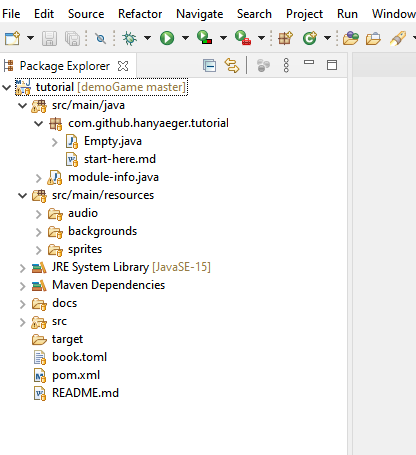
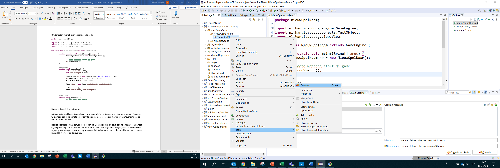
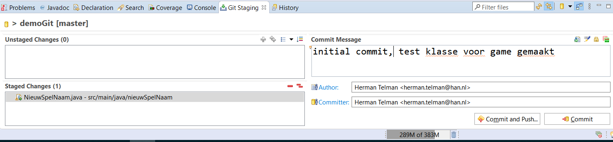
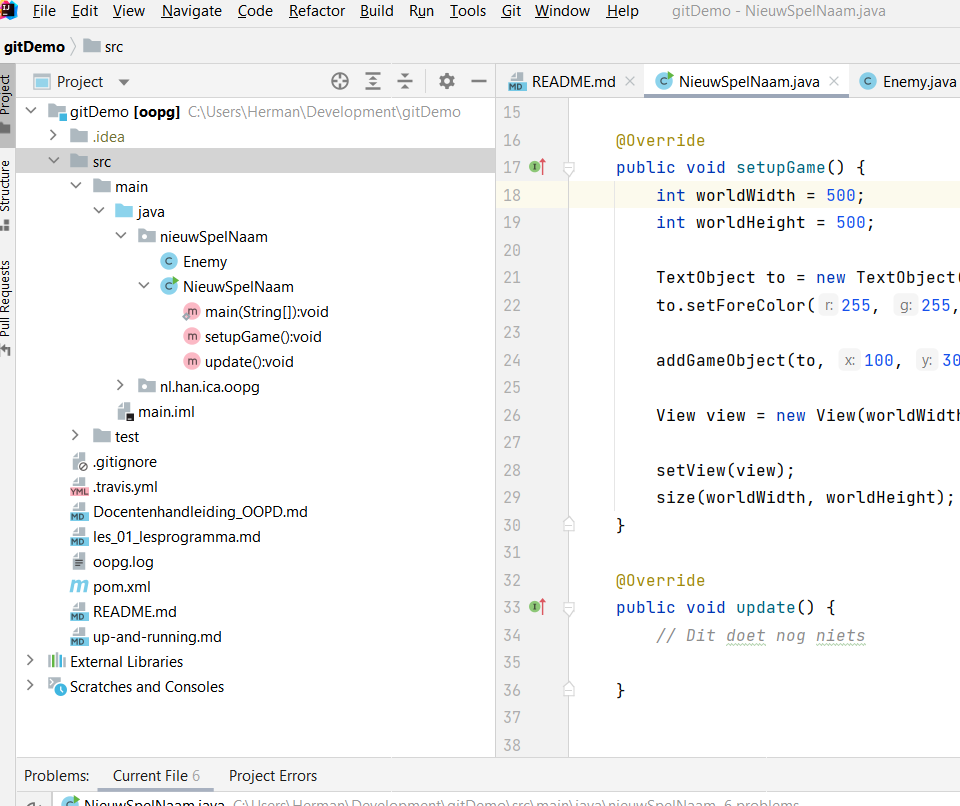
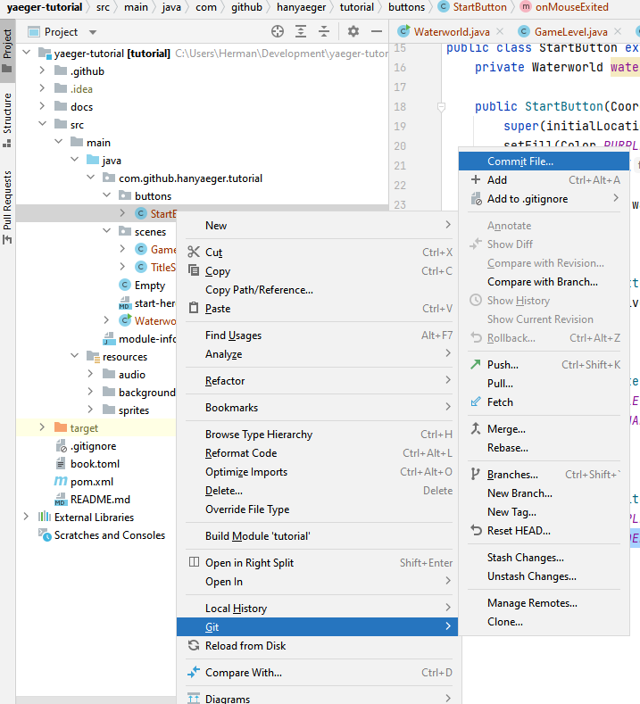
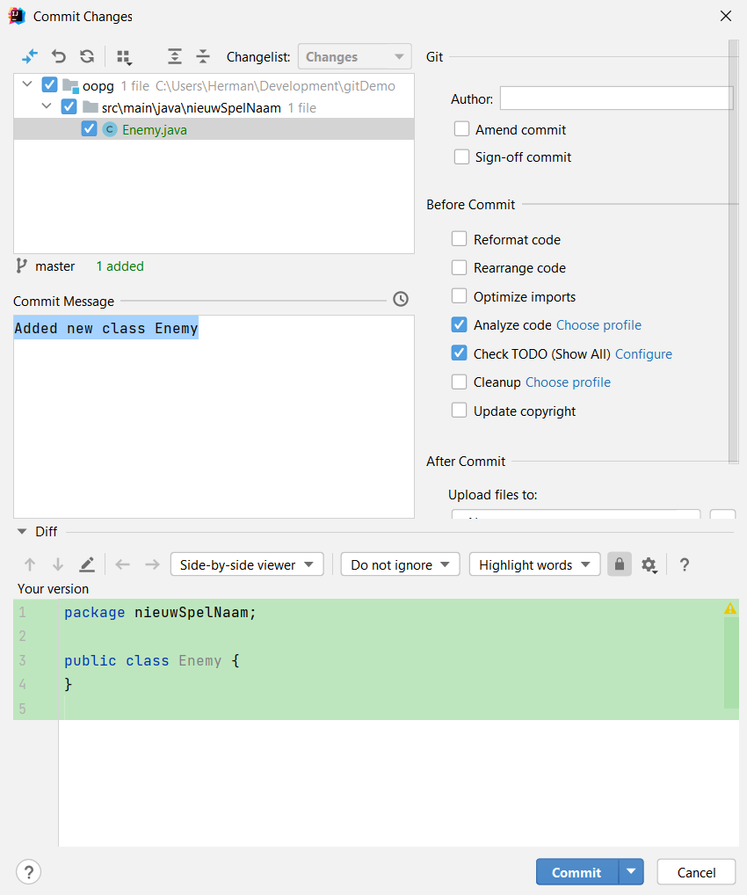

# Werken met Git

## Werken met Git in Eclipse

Wanneer je het project hebt geïmporteerd zul je zoiets als het onderstaande scherm te zien krijgen:

Er is van alles meegekomen met de Import, maar daar hoef je niet naar om te kijken. Voor jou is vooralsnog de eerste folder van belang (src/main/java).

Je ziet dat achter de naam van je project tussen blokhaken de naam van de (lokale) repo staat met daarachter master. Dit is de branch-naam, in dit geval dus master.

Eén van de teamleden gaat nu een begin maken met jullie game. Je kunt hiervoor dezelfde stappen zetten als in [de Yaeger Tutorial], maar in plaats van Waterworld gebruik je nu de naam van je eigen game.

Maak nu dus de 1^ste^ klasse van je game die de `YaegerGame` klasse extend.

(Run je code en kijk of het werkt, als het goed is krijg je nu even een splash-screen te zien, waarna de applicatie sluit.)

Git is zoals gezegd een versie-beheer tool. Om ook daadwerkelijk gebruik te maken van de mogelijkheid die git heeft om versies te beheren, zul je af en toe een momentopname (a.k.a. snapshot/checkpoint) moeten maken van je code. In git termen noemen we dit een *commit*.

Rechtsklik hiervoor op de java file, en kies voor Team \> Commit...

Er wordt onder in je scherm een tabblad geopend genaamd **Git Staging.**

Hier zie je een venster met al je 'Unstaged Changes'. Selecteer de file die je wilt 'stagen' door op het plus teken te klikken. Je kunt alle files in een keer stagen door op het ++ teken te klikken. Hoewel je niet alle wijzigen die je hebt aangebracht mee hoeft te nemen (stagen) in dezelfde commit, is dat in de meeste gevallen wel het geval.

Vul in het venster 'Commit Message' een duidelijke omschrijving van je commit in en klik op button 'Commit'.

(Je ziet hier ook de button 'Commit and Push', deze gaan we gebruiken wanneer we ook een remote repository hebben (in de cloud) )

Je gaat natuurlijk niet voor elke kleine wijziging een commit doen. Meestal zal dat een groep wijzigingen zijn die allemaal iets met elkaar te maken hebben (b.v. te maken hebben met 1 feature binnen je game). De message die je meegeeft is belangrijk dat deze een duidelijk omschrijving geeft wat de commit inhoud. Zo kun je makkelijker vaststellen naar welke situatie (=commit) je je code zou willen terugzetten, mocht het bij de laatste commit toch nog iets niet goed blijken te zijn.

## Werken met Git in IntelliJ

Wanneer je het project hebt geïmporteerd zul je zoiets als het onderstaande scherm te zien krijgen:

Er is van alles meegekomen met de Import, maar daar hoef je niet naar om te kijken. Voor jou is vooralsnog de eerste folder van belang (src/main/java).

Eén van de teamleden gaat nu een begin maken met jullie game. Je kunt hiervoor dezelfde stappen zetten als in [de Yaeger Tutorial], maar in plaats van Waterworld gebruik je nu de naam van je eigen game.

Maak nu dus de 1^ste^ klasse van je game die de *YaegerGame* klasse extend.

(Run je code en kijk of het werkt, als het goed is krijg je nu even een splash-screen te zien, waarna de applicatie sluit.)

Git is zoals gezegd een versie-beheer tool. Om ook daadwerkelijk gebruik te maken van de mogelijkheid die git heeft om versies te beheren, zul je af en toe een momentopname (a.k.a. snapshot/checkpoint) moeten maken van je code. In git termen noemen we dit een *commit*.

Rechtsklik hiervoor op de java file, en kies voor Git \> Commit...

Wanneer Commit.. wordt geselecteerd, kom je in de Commit dialoog window. Hier kun je selecteren wat je in deze Commit mee wilt nemen.

Vul in het tekst vak Commit Message, een duidelijk beschrijving in van de commit.

