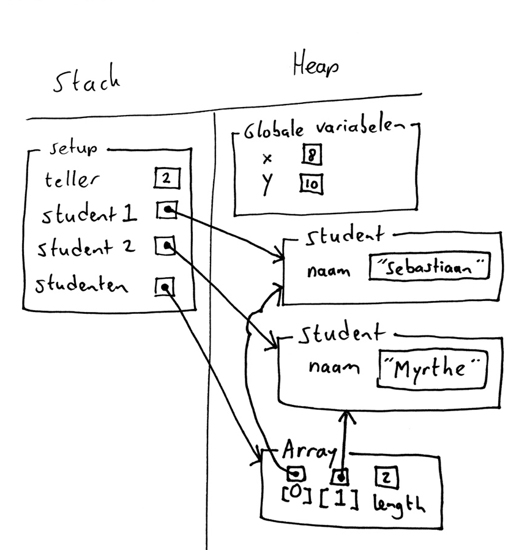
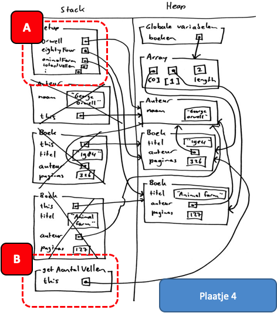
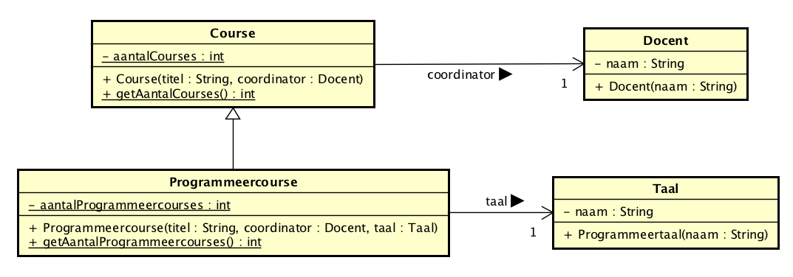

# Inleiding

## Introductie

Het geheugenmodel is een conceptuele weergave van de toestand van het geheugen op een bepaald moment tijdens de uitvoering van een programma. Het tekenen van een geheugenmodel helpt je te begrijpen wat er in het geheugen gebeurt en kan je op deze manier helpen de werking van je programma te verklaren en eventuele fouten in je programma op te sporen. We besteden tijdens OOPD veel aandacht aan het tekenen van deze modellen (en we toetsen er ook op in de schriftelijke toetsen), omdat we graag willen dat je een goed inzicht krijgt in hoe omgegaan wordt met methodes, variabelen, objecten, verwijzingen naar objecten, globale variabelen, arrays, et cetera.

Het geheugenmodel wordt uitgelegd in de [screencasts](https://www.youtube.com/playlist?list=PLpd9jJvk1PjmtR_LDjx6Ao8ddS5Q_-30a). Dit document bevat de belangrijkste tekenafspraken met enkele voorbeelden.

## Momentopname

Zoals hierboven al genoemd werd, is het geheugenmodel een weergave van het geheugen *op een bepaald moment*. Dat betekent dat het model zich ontwikkelt tijdens de uitvoer van het programma. Als iemand je dus vraagt het geheugenmodel te tekenen van een bepaald stuk code zonder dat aangewezen wordt op welk moment tijdens de uitvoer, is het dus niet mogelijk om dat te doen.

# Elementen geheugenmodel

## Voorbeeld

We beginnen met een voorbeeld van een geheugenmodel van een programma, waarin bijna alle elementen die in een geheugenmodel kunnen voorkomen zijn getekend (static ontbreekt hier nog, omdat dat pas relatief laat in OOPD wordt geïntroduceerd; verderop in de handleiding vind je daar voorbeelden van).


*Afbeelding 1*

## Heap en stack

Elk geheugenmodel bestaat uit twee kolommen. De ene kolom bevat alle elementen die op de stack staan, de andere de elementen op de heap.

### Stack

In de kolom die "Stack" heet, bevinden zich stack frames. Een stack frame wordt getekend op het moment dat het programma begint met het uitvoeren van een bepaalde methode. Het onderste stack frame dat je ziet is altijd het stack frame waarmee het programma zich op dit moment bezighoudt, en zodra het programma daarmee klaar is, gaat het altijd verder met het eerste stack frame dat erboven staat. Als er zich geen stackframes meer in het geheugenmodel bevinden, betekent dat dat het programma is afgelopen In de stack is de volgorde waarin dingen getekend worden dus betekenisvol. In 2.4 Stack frames staat beschreven welke elementen er in een stack frame worden getekend.

### Heap

In de kolom die "Heap" heet, kunnen zich verschillende soorten elementen bevinden. Zo is er ruimte voor globale variabelen, arrays en ArrayLists, horen objecten/instanties er thuis en worden static variabelen (in hun klasse) hier getekend. Verderop in het document lees je hier meer over. In de heap is er geen sprake van volgorde: de elementen die zich er bevinden, kunnen overal staan (al is het wel overzichtelijk om het blok met globale variabelen bovenin te tekenen).

## Variabelen

Variabelen hebben een naam (of in een array of ArrayList een volgnummer) en een waarde. De waarde kan van een *primitief type* zijn (grofweg: wanneer het datatype met een kleine letter begint, of als het een String is[^1]). In dat geval staat de waarde expliciet genoemd in het vakje dat bij de variabele hoort. In Afbeelding 1 bevat het stack frame `setup` bijvoorbeeld een primitieve variabele met de naam `teller` en de waarde *2*. Het bovenste object `Student` (op de heap) bevat een Stringvariabele met de naam `naam` en de waarde "Sebastiaan" (die waarde staat tussen aanhalingstekens om aan te geven dat het om een String gaat).

De waarde van een variabele kan ook een verwijzing zijn naar een element op de heap (een object, een array of een ArrayList). In dat geval teken je een pijltje. In Afbeelding 1 bevat het stack frame **setup** bijvoorbeeld twee variabelen (`student1` en `student2`) die verwijzen naar een object, en een variabele (`studenten`) die verwijst naar een array.

In Afbeelding 1 staat ook een array (waarnaar wordt verwezen in de waarde van de variabele `studenten`). Deze bevat twee variabelen die een volgnummer hebben (beide verwijzingen naar `Student`-objecten) en een variabele `length` met de waarde *2* staat.

## Stack frames

Een stack frame bestaat uit de naam van de methode, en de lokale variabelen die binnen die methode bestaan op het moment dat het geheugenmodel getekend wordt (in het geval van een methode die wordt aangeroepen op een object, hoort de variabele `this` daar ook altijd bij). In Afbeelding 2 zie je dat het stack frame `setup` vier lokale variabelen bevat. Variabelen in een stack frame houden op te bestaan zodra de methode is afgerond en het stack frame van de stack wordt verwijderd. Van primitieve variabelen verdwijnen de waarden ook. Van verwijzingen verdwijnen wel de pijltjes, maar de objecten, arrays of ArrayLists waarnaar wordt verwezen niet altijd (in de regel verdwijnen die pas als er geen enkel pijltje meer naar wijst[^2]).

De naam van het stack frame is altijd de naam van de methode, ook als het gaat om een methode die wordt aangeroepen op een object. In dat geval zie je namelijk aan de variabele `this` bij welk object de aanroep hoort. Zie Afbeelding 2.


*Afbeelding 2*

## Objecten / instanties


*Afbeelding 3*

Objecten (ook wel "instanties" genoemd) staan altijd op de heap. Bovenaan staat de naam van de klasse waarvan het object een instantie is (zo staat er in Afbeelding 1 bij beide objecten `Student` en in Afbeelding 3 staat `Huis`). Objecten in het geheugenmodel bevatten alle variabelen die bij het object horen (static variabelen horen hier *niet* bij, zie paragraaf 2.8). Als je een object op de heap tekent, kun je dus altijd meteen alle eigenschappen (variabelen die bij het object horen) overnemen en er vakjes bij tekenen. In Afbeelding 3 zie je een klasse `Huis` in code. Wanneer daarvan ergens in de code een object wordt aangemaakt, wordt dat object op de heap getekend en kunnen beide eigenschappen dus meteen in het object getekend worden.

## Arrays / ArrayList

Arrays en ArrayLists zijn verzamelingen van variabelen. Om het overzichtelijk te houden, zetten we deze variabelen naast elkaar en staat het volgnummer behorend bij elke variabele eronder en tussen vierkante haakjes (zo dus: \[0\]). De variabelen worden verder net zo getekend als variabelen die een naam hebben (zie paragraaf 2.3). In Afbeelding 4 zie je een paar voorbeelden van arrays en ArrayLists zoals ze in het geheugenmodel zouden kunnen staan.


*Afbeelding 4*

Arrays hebben een variabele met de naam `length` waarin het aantal elementen in de array staat. ArrayLists hebben een dergelijke variabele niet.

## Pijlen

Pijlen beginnen *altijd* in het vakje dat bij een variabele hoort (kan op de stack zijn, maar ook in de heap) en eindigen *altijd* bij een element op de heap (een object, een array of een ArrayList).

## Static

Wanneer een klasse static variabelen bevat, horen deze niet meer bij een specifieke instantie. Ze hebben daarom een aparte plaats nodig in het geheugenmodel. Je groepeert de static variabelen die bij een bepaalde klasse horen in een element op de heap. Je kunt dit element meteen bij de start van het programma tekenen, want dat is het moment dat deze variabelen ontstaan.

Je tekent een static element door de naam van de klasse tussen vishaken te zetten ("\<" en "\>", dit is de notatie die je ook gebruikt bij een ArrayList om aan te geven van welke *klasse* er objecten in te vinden zijn) en de rand te tekenen met een stippellijn. Er wordt *nooit* een pijltje getekend naar een static element. Zie Afbeelding 5, waarin je een object van de klasse `Toetsenist` ziet. Deze klasse heeft ook een static variabele `nToetsenisten` waarin we bijhouden hoeveel toetsenisten er zijn.


*Afbeedling 5*

## Overerving en interfaces

Overerving en interfaces zie je niet terug in het geheugenmodel: je tekent altijd alleen de dynamische types van objecten. Uiteraard neem je wel alle (toegankelijke) overgeërfde variabelen op in de tekening (zie het voorbeeld in paragraaf 3.3).

# Voorbeelden

## Inleiding

Zoals hierboven al werd gezegd, geeft het geheugenmodel de situatie weer op een bepaald moment tijdens de uitvoer van een programma. Om zeker te weten dat je tekening volledig is, is het verstandig om de code vanaf het begin door te nemen en elke stap te tekenen, tot je op het punt komt waarin je geïnteresseerd bent. In dit hoofdstuk staat beschreven hoe je tot zo'n tekening komt en welke stappen je daarvoor moet zetten. Zodra je wat meer ervaring hebt met het tekenen van geheugenmodellen, kun je soms besluiten om tussenstappen over te slaan.

Hieronder staan twee uitgewerkte voorbeelden. Het eerste voorbeeld beschrijft stap-voor-stap hoe je tot een geheugenmodel kunt komen. In het tweede voorbeeld worden twee specifieke situaties uitgelegd (overerving en static), waarbij minder detailstappen worden toegelicht.

## 'Boeken' in Processing

Gegeven is de volgende code.

```java
01 Boek boeken[] = new Boek[2];
02
03 void setup() {
04    Auteur orwell = new Auteur("George Orwell");
05    Boek eightyFour = new Boek("1984", orwell, 326);
06    Boek animalFarm = new Boek("Animal farm", orwell, 127);
07
08    boeken[0] = eightyFour;
09    boeken[1] = animalFarm;
10
11    int totaalVellen = 0;
12
13    for (int i = 0; i < boeken.length; i++) {
14       totaalVellen += boeken[i].getAantalVellen();
15    }
16    println(totaalVellen);
17 }
18
19 class Boek {
20    String titel;
21    Auteur auteur;
22    int paginas;
23
24    Boek (String titel, Auteur auteur, int paginas) {
25       this.titel = titel;
26       this.auteur = auteur;
27       this.paginas = paginas;
28    }
29
30    int getAantalVellen() {
31       if (paginas % 2 == 0) {
32          return paginas / 2;
33       } else {
34          return (paginas / 2) + 1;
35       }
36    }
37 }
38
39 class Auteur {
40    String naam;
41
42    Auteur (String naam) {
43       this.naam = naam;
44    }
45 }
``` 

Stel nu dat ons wordt gevraagd om het geheugenmodel te tekenen op het moment dat de uitvoering aan het einde van regel 14 is en de for-loop voor de eerste keer wordt uitgevoerd (dus als *i* de waarde 0 heeft). We kunnen dan als volgt te werk gaan (nummers tussen vierkante haken zijn steeds verwijzingen naar een gemarkeerd stuk van een tekening: \[3.A\] betekent dus dat hiermee het met "A" gemarkeerde stukje van plaatje 3 wordt bedoeld):

1.  We tekenen de kolommen "Stack" en "Heap"

2.  We tekenen de globale variabele op de heap in een vakje voor de globale variabelen. \[1.A\]

3.  Aangezien de globale variabele `boeken` een array van 2 posities is, tekenen we die op de heap (met de variabele length alvast op 2 gezet). De genummerde variabelen blijven voorlopig nog leeg. \[1.B\]

4.  De array wordt toegekend aan de globale variabele `boeken`, dus we trekken een pijl van die globale variabele naar de array.


5.  De uitvoer van het programma begint bij de methode `setup` (regel 03). We tekenen daarvan dus het stack frame.

6.  In het stack frame van `setup` wordt een variabele `orwell` aangemaakt (regel 04), die tekenen we in het stack frame met een leeg blokje erbij (omdat we weten dat er nog wat meer variabelen bij gaan komen, tekenen we het stack frame ruim). \[1.C\]

7.  Op regel 04 wordt de constructor van `Auteur` aangeroepen. Dit is een methode, en hiervoor tekenen we dus het stack frame `Auteur` \[1.D\]. Er is een parameter, die tekenen we meteen en vullen ook de meegegeven waarde in (let op: de `naam` die je hier tekent is dus de parameter en niet de instantievariabele met dezelfde naam!). Omdat een constructor bij een object gaat horen, tekenen we ook de variabele `this`.

8.  Een constructor maakt een object aan op de heap, dus we tekenen dat object (de klasse van het object is bekend, en het is ook bekend dat er een variabele `naam` in dat object hoort, dus die kunnen we alvast tekenen met een leeg vakje \[1.E\]). Ook trekken we de pijl van `this` (in het stack frame `Auteur`) naar het nieuw aangemaakte object `Auteur` op de heap.

9.  In de constructor van de klasse `Auteur` wordt op regel 43 de meegegeven waarde `naam` gekopieerd naar de objectvariabele `naam`. Deze kunnen we dus invullen.

10. De constructor is nu klaar, dus we kunnen deze van het stack frame verwijderen \[2.A\]. Op regel 04 zien we dat het resultaat van de constructor wordt toegewezen aan de variabele `orwell`, dus we kunnen een pijl trekken van die variabele naar het nieuw aangemaakte object op de heap.
 

11. Op regel 05 wordt opnieuw een variabele aangemaakt in het stack frame en wordt een constructor aangeroepen. In dit geval is dat de constructor *Boek*, en deze krijgt een String (*"*1984*"*), een `Auteur` (de inhoud van de variabele `orwell`) en een int (*326)* mee. Deze worden allemaal gekopieerd naar variabelen in het stack frame `Boek`. Zoals je ziet maakt de volgorde van variabelen in een stack frame niet uit, en wordt nu de variabele `this` onderaan de lijst geplaatst (bij `Auteur` deden we dat onderaan). \[2.B\].

12. Er wordt een `Boek`-object aangemaakt op de heap (`this` verwijst daarnaar) \[2.C\]. De inhoud van de variabelen in de constructor worden gekopieerd naar het nieuwe object.


13. De constructor wordt van het stack frame verwijderd \[3.A\] en de variabele `eightyFour` verwijst nu naar het nieuwe `Boek`-object.

14. Dezelfde stappen worden nogmaals uitgevoerd voor de aanmaak van een nieuw Boek-object op regel 06. Na afloop bevat de variabele `animalFarm` dus een verwijzing naar dat nieuwe object (de gezette stappen zijn wel te zien in plaatje 3, maar worden hier niet besproken).

15. In regels 08 en 09 worden de twee nog lege waarden in de array waarnaar de globale variabele `boeken` verwijst gevuld met verwijzingen naar de `Boek`-objecten \[3.B\].

16. Op regel 11 wordt in het stack frame `setup` een nieuwe variabele aangemaakt met de naam `totaalVellen` waarvan de waarden op 0 wordt gezet \[4.A\].

17. Op regel 12 wordt een variabele *i* aangemaakt die op 0 wordt gezet \[4.A\].


18. Op regel 14 wordt de methode `getAantalVellen` aangeroepen op `boeken\[0\]`. Als we de verwijzingen volgen, zien we dat *boeken* de globale variabele is die verwijst naar de array, en dat het 0'de element van die array verwijst naar het `Boek`-object met "1984" als titel. Kennelijk wordt daar dus de methode op aangeroepen, en vandaar dat we het stack frame kunnen tekenen en `this` naar het `Boek`-object met "1984" als titel kunnen laten wijzen \[4.B\].

19. De methode `getAantalVellen` maakt geen variabelen aan, dus het stack frame wordt niet verder gevuld. De berekening vindt plaats (in dit geval wordt bepaald dat de te retourneren waarde 163 is), de waarde wordt geretourneerd (het stack frame van `getAantalVellen` verdwijnt) en in regel 14 zien we dat het totaal wordt opgeteld bij de huidige waarde van `totaalAantalVellen` in het stack frame `setup`. Deze komt daarmee op 163. Het gevraagde geheugenmodel is nu klaar \[5\].


## 'Onderwijseenheden' in Java

In dit voorbeeld wordt een geheugenmodel getekend van een kleine applicatie waarvan het klassendiagram hieronder gegeven is. Zoals je ziet gaat dit voorbeeld over courses bij ICA en is er sprake van overerving, van een static variabele en van een static methode (de getter).



De bijbehorende code is hieronder gegeven:

```java
01 public class Docent {
02    private String naam;
03
04    public Docent(String naam) {
05       this.naam = naam;
06    }
07 }
08
09 public class Programmeertaal {
10    private String naam;
11
12    public Programmeertaal(String naam) {
13       this.naam = naam;
14    }
15 }
16
17 public class Course {
18    private String titel;
19    private Docent coordinator;
20
21    public Course(String titel, Docent coordinator) {
22       this.titel = titel;
23       this.coordinator = coordinator;
24    }
25 }
26
27 public class Programmeercourse extends Course {
28    private Taal taal;
29    private static int aantalProgrammeercourses = 0;
30
31    public Programmeercourse(String titel, Docent coordinator, Programmeertaal taal) {
32       super(titel, coordinator);
33       this.taal = taal;
34       aantalProgrammeercourses++;|
35    }
36
37    public static int getAantalProgrammeercourses() {
38       return aantalProgrammeercourses;
39    }
40 }
41
42 public class Hoofdprogramma {
43    public static void main(String[] args) {
44
45       Programmeertaal java = new Programmeertaal("Java");
46       Course dbap = new Course("DbAp", new Docent("Misja"));
47       Programmeercourse oopd = new Programmeercourse("OOPD", new Docent("Ralph"), java);
48
49       int aantalProgrammeercourses = Programmeercourse.getAantalProgrammeercourses();
50
51       System.out.println(aantalProgrammeercourses);
52    }
53 }
```

Als nu het geheugenmodel wordt gevraagd op het moment dat de methodeaanroep op regel 49 bezig is en daar regel 38 net klaar is (met stack frame van `getAantalProgrammeercourses` nog niet verwijderd), ziet dit er als volgt uit (tussenstappen zijn overgeslagen, dus de constructors zijn weg: je zult zelf nooit gevraagd worden de constructors te laten zien bij een overervingsconstructie). Een paar opvallende zaken:

-   In de objecten is niets terug te zien van de overerving: je ziet daar alleen het dynamisch type (in dit geval `Programmeercourse`).
-   Er is geen relatie getekend tussen de objecten van de klasse *Programmeercourse* en het static element met dezelfde naam.
-   De methode `getAantalProgrammeercourses` bevat geen `this`, omdat er geen referentie is met een specifiek object (het gaat immers om een static methode).


[^1]: Feitelijk is een String geen primitief type, maar tijdens OOPD doen we net alsof dat wel zo is.

[^2]: In Java zorgt de zogenaamde garbage collector ervoor dat objecten, arrays en ArrayLists op de heap daadwerkelijk worden weggegooid. Omdat de garbage collector niet op vaste momenten langskomt, kun je eigenlijk niet weten of het element nog bestaat als er geen pijltjes meer naar wijzen. Je mag die zaken dus laten staan of weghalen in het geheugenmodel: het maakt niet uit.