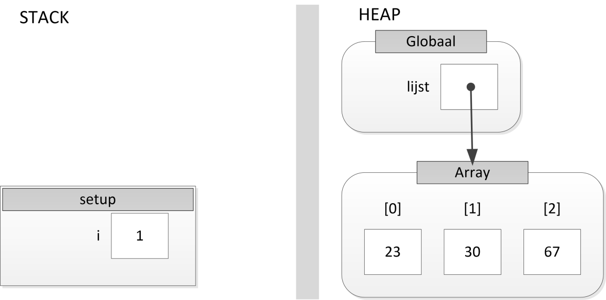

Les 2 - Lesprogramma (L2)
===

# Opgave L2.1 - Length

*Klassikaal, begrip*

Gegeven onderstaand programma
```java
01 int[] lijst = {23, 30, 67};
02 void setup() {
03    for (int i = 0; i < lijst.length; i++) {
04       println(lijst[i]);
05    }
06 }
```

Hieronder is het geheugenmodel te zien van het programma in de for-lus net na de aanroep van println op regel 5.


 
## L2.1 A

Teken de variabele length met bijbehorende waarde op de juiste plek in dit model.

## L2.1 B

Vergelijk de .-operator (in `lijst.length`) met de \[\]-operator (`lijst[i]`). Wat is de overeenkomst tussen beide operatoren?

*Tags: geheugenmodel, eigenschap, operatoren*


# Opgave L2.2 - PlakCodeVoor

*Individueel en klassikaal, programmeerstijl, programmeervaardigheid*

Gegeven onderstaande stuk code.

```Java
String[] idLijst = {"8b3", "4bf", "9h0"};

void setup() {
   println(plakCodeVoorId(idLijst[0], "NL"));
}

String plakCodeVoorId(String id, String code) {
   return code + id;
}
```

In de variabele `idLijst` staan drie strings die gebruikt worden voor identificaties. In het hoofdprogramma wordt de code \"NL\" voor het eerste id geplakt uit `idLijst`. Hiervoor wordt de functie `plakCodeVoorId` gebruikt.

## L2.2 A

Ga ervan uit dat er een methode bestaat `plakCodeVoorIdLijst(String[] lijst, String code)` die de string in de variabele code voor elk element uit lijst plakt.
Schrijf een test in `setup` waarmee je deze methode zou kunnen testen. Zie opgave \"Zoeken in Array\" uit lesprogramma 1 voor de manier om een test op te zetten.

## L2.2 B

Implementeer de methode `plakCodeVoorIdLijst(String[] lijst, String code)` en zorg ervoor dat je de test uit opgave A slaagt.

## L2.2 C

*Direct klassikaal, of eerst in tweetallen*

Vergelijk jouw implementatie met die van anderen. Welke oplossing is het meest stijlvol en welke oplossing het minst?

## L2.2 D

*Direct klassikaal, of eerst in tweetallen*

Had de methode `plakCodeVoorIdLijst(String[] lijst, String code)` ook `plakCodeVoorId(String[] lijst, String code)` kunnen heten zonder een foutmelding te krijgen?

*Tags: referentievariabele, array, overloading, new, return, geheugenmodel*


# Opgave L2.3 - NotInitializedYet

*Klassikaal, begrip*

Voer onderstaand programma uit en je krijgt een foutmelding.

```Java
void setup() {
   int[] deLijst;
   deLijst[0] = 1;
   
   println(deLijst);
}
```

Wat is de foutmelding?
Is dit een runtimefout, of een compile-time foutmelding.
Teken het geheugenmodel op het moment dat regel 3 wordt uitgevoerd en leg aan de hand van dit model uit welke vervelende situatie deze foutmelding heeft voorkomen.

*Tags: compile-time foutmelding \<\> runtime foutmelding, new, initialiseren, referentievariabele*


# Opgave L2.4 - Product

*Klassikaal, nieuwe stof*

Bekijk onderstaande code:

```Java
void setup() {
   String product1naam = "pc";
   String product2naam = "mac";
   
   int product1prijs = 500;
   int product2prijs = 2000;
   
   println(product1naam + " kost: " + product1prijs + " euro");
   println(product2naam + " kost: " + product2prijs + " euro");
}
```

## L2.4 A

We willen graag gebruik maken van een loop om alle producten te printen. Pas de code zo aan dat dit mogelijk is.

## L2.4 B

*Uitleg*

Laten we naar één product kijken. We willen de eigenschappen naam en prijs groeperen. Dus we willen een 'ding' hebben met de eigenschappen naam en prijs:

```Java
void setup() {
   ??Type?? product1;

   product1.naam = "pc";
   product1.prijs = 500;

   println(product1.naam + " kost: " + product1.prijs + " euro");
}
```

Vergelijk naam en prijs met de eigenschap `length` van array.
Het type van product1 moeten we zelf maken en dat doen we in een class (klasse). In deze klasse specificeren we ook alle eigenschappen en geven we een methode waarmee je een variabele van het gedefinieerde type kunt maken. Vergelijk dit met bijvoorbeeld `String[] lijst = new String[]()`. Ook voor onze zelf gedefinieerde type willen we iets dergelijks doen met het keyword **new.**

## L2.4 C

Maak een tweede product object voor de MAC.
Moeten we ook een nieuwe klasse maken?


# Extra Oefeningen

# Opgave L2.5 - Geheugenmodel van doeFunctie

In opgave doeFunctie, onderdeel A uit de vorige les heb je een runtime administratie van alle variabelen gemaakt tijdens de uitvoer van het programma. Schrijf deze administratie om naar een geheugenmodel.

*Tags: stap voor stap doorlopen, runtime administratie, geheugenmodel*


# Opgave L2.6 - Samenvatting geheugenmodel

De opgaven gaan over de onderstaande code:

```Java
01 int[] deLijst;
02 int hetGetal;
03 
04 void setup() {
05    hetGetal = 10;
06    deLijst = maakLijstMetEenGetal(2, hetGetal); 
07 }
08 
09 int[] maakLijstMetEenGetal(int lengte, int getal) {
10    int[] lijst = new int[lengte]; 
11    
12    for (int i = 0; i < lijst.length; i++) {
13       lijst[i] = getal;
14    }
15 
16    return lijst;
17 }
```

## L2.6 A

Teken het geheugenmodel :

-   na regel 2 en voor regel 4
-   na regel 5 en voor regel 6
-   tijdens de uitvoer van de methode op regel 6 en binnen deze methode na regel 9 en voor regel 10.
-   tijdens de uitvoer van de methode op regel 6 en binnen deze methode na regel 14 en voor regel 16.
-   na regel 6 en voor regel 7

## L2.6 B

Hoe ziet de laatste versie van het geheugenmodel eruit als de declaratie van de variabelen `deLijst` en `hetGetal` in setup uitgevoerd wordt zoals hieronder te zien is:

```Java
01 void setup() { 
02 int hetGetal = 10;
03 int[] deLijst = maakLijstMetEenGetal(2, hetGetal);
04 }
   // .. rest van de code weggelaten
```

## L2.6 C

Verklaar aan de hand van het geheugenmodel dat de methode setup niet bij de variabelen `lengte`, `getal` en `lijst` kan komen, maar de methode `maakLijstMetEenGetal` wel bij de variabele `deLijst` en `hetGetal`.
Gebruik in de uitleg zoveel mogelijk de technische begrippen die tot nu toe zijn behandeld.

## L2.6 D

Is het, over het algemeen, verstandig om de methode `maakLijstMetEenGetal` gebruik te laten maken van `deLijst` en `hetGetal`.
Gebruik in de uitleg zoveel mogelijk de technische begrippen die tot nu toe zijn behandeld.
