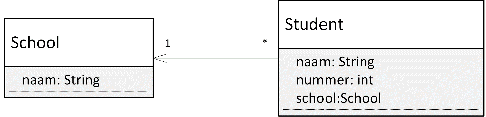

Les 5 - Voorbereiding (V5)
===

# Theorie

## Screencast onderwerp 3 interactie tussen objecten

<http://www.youtube.com/playlist?list=PLpd9jJvk1Pjlt8c30X9uu7N9r2aQVey93>

## Boek

### Hoofdstuk 3

3.1 t/m 3.11 (pagina 98 t/m 115)

3.16 (pagina 128 t/m 131)


# Opgave V5.1 - Dambord met stenen

## V5.1 A

Maak een dambord volgens onderstaande specificatie.

### Instantievariabele

Een dambord bevat een Array genaamd `stenen` waarin vier damstenen zitten. Twee van deze stenen zijn zwart, twee wit. De positie en de diameter van de damstenen maakt niet uit als de diameter van elke steen maar gelijk is.

### Methode

Een dambord heeft één methode: `tekenDamstenen()` die alle damstenen die in de variabele stenen zit tekent.

Je kunt onderstaand klassendiagram gebruiken.


## V5.1 B

Test de klasse `Dambord` met bijbehorende methode `tekenDamstenen` in het hoofdprogramma.


# Opgave V5.2 - Student op School

Gegeven onderstaande klassendiagram.



Met bijbehorende code:

## Klasse School

```java
01 class School {
02    String naam;
03    
04    School(String naam) {
05       this.naam = naam;
06    }
07 }
```

## Klasse Student

```java
01 class Student {
02    String naam;
03    int nummer;
04    School school;
05 
06    Student(String naam, int nummer, String school) {
07       this.naam = naam;
08       this.nummer = nummer;
09       this.school = new School(school);
10    }
11 }
```

## Hoofdprogramma

```java
01 void setup() {
02    School deSchool = new School("AIM");
03
04    Student s1 = new Student("hanneke", 1, "AIM");
05    Student s2 = new Student("femke", 2, "AIM");
06 }
``` 

De constructor van de klasse `Student` bevat een fout die vaak voorkomt en makkelijk verborgen blijft. Het datatype van de parameter `school` is onhandig, waardoor in regel 9 de fout ontstaat.

## V5.2 A

Teken het geheugenmodel van het hoofdprogramma op het moment dat deze regel 5 net heeft uitgevoerd.

## V5.2 B

Leg op basis van deze schets uit wat er fout gaat.

## V5.2 C

Lost onderstaande verbetering op regel 4 en 5 aan het hoofdprogramma de fout op?

```java
01 void setup() {
02    School deSchool = new School("AIM");
03
04    Student s1 = new Student("hanneke", 1, deSchool.naam);
05    Student s2 = new Student("femke", 2, deSchool.naam);
06 }   
```

*Tags: referentievariabele, verschillende <> dezelfde instantie*