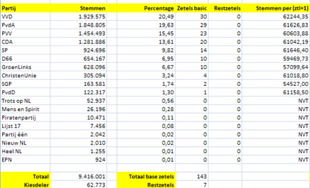

Les 9 - Lesprogramma (L9)
===


# Opgave L9.1 - Static ABC

Gegeven onderstaande 3 klassen (A, B en C):

```java
public class A {
   private static String a = "a";
   
   public static String getA() {
      return a;
   }
}

public class B {
   private static String b = "b";

   public String getB() {
      return b;
   }
}

public class C {
   private String c = "c";

   public static String getC() {
      return c;
   }
}
```

## L9.1 A

Welke klasse (A, B, of C) compileert niet?

## L9.1 B

Leg uit wat de reden voor deze foutmelding is?


# Opgave L9.2 - Studieadvies I

Gegeven de klasse `Student`. Een student heeft een naam en een cijferlijst met acht cijfers. Voor het gemak zijn de cijfers integers.

```java
public class Student {
   private String naam;
   private int[] cijfers;
   
   public Student(String naam) {
      this.naam = naam;
      cijfers = new int[8];
   }

   public void setCijfer(int vaknummer, int cijfer) {
      cijfers[vaknummer] = cijfer;
   }

   public int[] getCijfers() {
      return cijfers;
   }

   public String toString() {
      String representatie = "naam: " + naam + "\ncijfers: ";
      for (int cijfer : cijfers) {
         representatie += " " + cijfer;
      }

      return representatie;
   }
}
````


De klasse `Studieadviseur` krijgt de verantwoordelijkheid te bepalen of een student een positief studieadvies krijgt.

Een student krijgt een positief studieadvies als er ten minste vier cijfers zijn die groter of gelijk zijn aan een 6.

Hieronder is de definitie van de klasse te vinden:

```java
public class Studieadviseur {

   public static boolean krijgtPositiefStudieadvies(Student s) {

      //Implementatie moet je zelf maken, zie opgave

   }
}
```

Deze klasse kan met onderstaande code getest worden:

```java
public class TestStudieadviesApp {

   public static void main(String\[\] args) {
      Random r = new Random();
      Student s1 = new Student("persoon 1");
      
      for (int i = 0; i < 8; i++) {
         s1.setCijfer(i, r.nextInt(10) + 1);
      }
      
      System.out.println(s1);
      System.out.println(Studieadviseur.krijgtPositiefStudieadvies(s1));
      System.out.println("------------------");
   }
}
```

## L9.2 A

Implementeer de methode `krijgtPositiefStudieAdvies` in de klasse `Studieadviseur`.

## L9.2 B

Geef een reden waarom het een goede keuze is om de methode `krijgtPositiefStudieadvies` static te maken.

## L9.2 C

Het zou kunnen zijn dat de keuze om bovenstaande methode static te maken, niet in elke situatie een bruikbare keuze is. Verzin een situatie waarin de methode krijgtPositiefStudieadvies beter niet static kan zijn.


# Opgave L9.3 - Studieadvies II

Er wordt een klasse gemaakt waarmee studenten gegenereerd kunnen worden die een willekeurige cijferlijst hebben:

```java
public class RandomStudentenGenerator {
   private Student[] studentenLijst;
   
   public static void genereerStudenten(int aantal) {
      Random generator = new Random();
      studentenLijst = new Student[aantal];
      
      for (int i = 0; i < aantal; i++) {
         studentenLijst[i] = new Student("persoon_" + i);
         for (int j = 0; j < 8; j++) {
            studentenLijst[i].setCijfer(j, generator.nextInt(10) + 1);
         }
      }
   }

   public Student[] getStudentenLijst() {
      return studentenLijst;
   }
}
````

## L9.3 A

Plaats de code in je IDE en je krijgt (de bekende) foutmelding: *Cannot make a static reference to the non-static field studentenLijst*.

Leg uit wat er mis is.

## L9.3 B

Er zijn drie mogelijke oplossingen voor bovenstaande foutmelding:

#### Oplossing I: static toevoegen op twee plekken

```java
public class RandomStudentenGenerator {
   private static Student[] studentenLijst; //hier static toevoegen
   
   public static void genereerStudenten(int aantal) {
      Random generator = new Random();
      studentenLijst = new Student[aantal];
      
      for (int i = 0; i < aantal; i++) {
         studentenLijst[i] = new Student("persoon_" + i);
         for (int j = 0; j < 8; j++) {
            studentenLijst[i].setCijfer(j, generator.nextInt(10) + 1);
         }
      }
   }

   public static Student[] getStudentenLijst() { // hier static toevoegen
      return studentenLijst;
   }
}
````

#### Oplossing II: static verwijderen bij genereerStudenten

```java
public class RandomStudentenGenerator {
   private Student[] studentenLijst;
   
   public void genereerStudenten(int aantal) { // hier static verwijderen
      Random generator = new Random();
      studentenLijst = new Student[aantal];
      
      for (int i = 0; i < aantal; i++) {
         studentenLijst[i] = new Student("persoon_" + i);
         for (int j = 0; j < 8; j++) {
            studentenLijst[i].setCijfer(j, generator.nextInt(10) + 1);
         }
      }
   }

   public Student[] getStudentenLijst() {
      return studentenLijst;
   }
}
````


#### Oplossing III: instantievariabele verwijderen en return statement toevoegen

```java
public class RandomStudentenGenerator {
   
   public static Student[] genereerStudenten(int aantal) {
      Random generator = new Random();
      Student[] studentenLijst = new Student[aantal];
      
      for (int i = 0; i < aantal; i++) {
         studentenLijst[i] = new Student("persoon_" + i);
         for (int j = 0; j < 8; j++) {
            studentenLijst[i].setCijfer(j, generator.nextInt(10) + 1);
         }
      }
      return studentenLijst;
   }
}
````

Leg uit welke oplossing je het meest aantrekkelijk vindt.


# Uitdaging

# Opgave L9.4 - Verkiezingsuitslag

Bij verkiezingen voor de Tweede Kamer wordt de zetelverdeling berekend met behulp van een bijzondere procedure, waarbij het vooral gaat om de verdeling van de zogenaamde restzetels. De procedure gaat zo, met voorbeelden uit de uitslag van de verkiezingen van 2010:

• Men berekent eerst het totale aantal stemmen (2010: 9.416.001) en deelt dit door 150, dit is de kiesdeler (2010: 62.773).
• Elke partij krijgt een aantal zetels door het stemmenaantal van deze partij te delen door de kiesdeler en af te ronden naar beneden. De VVD kreeg in 2010 zo 30 volle zetels
• Sommige partijen hebben minder stemmen dan de kiesdeler, ze 'halen de kiesdrempel niet'. Zij krijgen geen zetels en doen verder ook niet mee in de verdeling van de restzetels.
• Omdat er naar beneden afgerond wordt en partijen de kiesdrempel niet halen, worden zo minder dan 150 zetels vergeven. De andere zetels - de restzetels - worden als volgt verdeeld:
o Voor elke partij deelt men het aantal stemmen door het aantal zetels plus 1 (voor de VVD bereken je dus 1929575 / 31).
o De partij met het grootste aantal stemmen per zetel krijgt een restzetel. (In 2010 kreeg de VVD de eerste restzetel) Voor die partij bereken je het aantal stemmen per zetel opnieuw (VVD: nu dus 1929575 / 32)
o Je herhaalt de vorige stap totdat alle restzetels vergeven zijn.

Let op! Het is niet goed genoeg om in één keer de volgorde van de aantallen stemmen per zetel af te gaan. Het kan namelijk gebeuren dat een grote partij eerder een tweede restzetel krijgt dan een andere, kleine partij. (Na het toekennen van de eerste restzetel daalt het aantal stemmen per zetel van de VVD tot ongeveer 60300, daardoor zou de VVD een tweede restzetel krijgen voor D66 de eerste krijgt.)

NB: De Nederlandse kieswet staat lijstverbindingen toe, waarbij twee of meer partijen bij elkaar genomen worden bij het verdelen van de restzetels. We laten deze buiten beschouwing.

Schrijf een programma dat de zetelverdeling berekent uitgaande van de aantallen stemmen per partij. Maak daarbij een ArrayList van 'PartijUitslagen', waarop je de procedure voor de zetelverdeling bij schrijft. Je hierbij gebruik maken van de startcode die op OnderwijsOnline staat: "Verkiezingsuitslagen.zip". De startcode bevat de uitslagen van vijf verkiezingen (periode 1998-2010).

