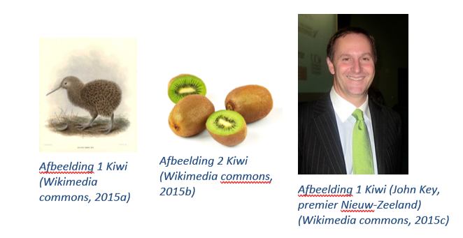

Les 10 - Voorbereiding (V10)
===

# Theorie

## Screencast onderwerp 7: Overerving

<http://www.youtube.com/playlist?list=PLpd9jJvk1PjmlCr4hMlUwdLF9nJNtYVwv>

## Boek

Hoofdstuk 10

10.1 t/m 10.6 pagina 370 t/m 391

Hoofdstuk 11

11.5 pagina 413 en 414

11.9 pagina 420 t/m 422


# Opgave V10.1 - Overervingshiërarchie

## V10.1 A

Teken een overervingshiërarchie (boek pagina 384) waarin de onderstaande klassen elk één keer voorkomen (Kiwi staat er dus drie keer in).

Dier, Vogel, Levensvorm, Vrucht, Mens, Kiwi, Kiwi, Kiwi.

Hint:



## V10.1 B

Implementeer de klassen `Vogel`, `Vrucht`, `Kiwi`  en `Kiwi` en los het naamconflict dat je krijgt op zonder de klassennamen van beide Kiwi's aan te passen (zie eventueel boek 6.5 pagina 224 en 225).


# Opgave V10.2 - Superconstructor 

In deze opgave maken we alleen gebruik van de klasse `Dier` en de klasse `Kiwi`.

## V10.2 A

Bekijk de constructor van de klasse `Kiwi`. Wanneer deze constructor wordt uitgevoerd, wordt eerst de constructor van dier uitgevoerd. Geef de header (boek pagina 36) van deze constructor.

```java
public class Dier {
   protected String naam;
}

public class Kiwi extends Dier {
   private int loopSnelheid;

   public Kiwi(String naam, int loopSnelheid) {
      this.loopSnelheid = loopSnelheid;
   }
}
```

## V10.2 B

De constructor die je bij opgave A hebt genoemd is niet expliciet gedefinieerd in de klasse `Dier`. Beschrijf zo exact mogelijk de spelregel die maakt dat deze constructor toch wordt uitgevoerd.

## V10.2 C

Er wordt een constructor toegevoegd aan de klasse `Dier`:

```java
public class Dier {
   protected String naam;

   public Dier(String naam) {
      this.naam = naam;
   }
}
```

Nu geeft de constructor van `Kiwi` (regel 4) de foutmelding

*Implicit super constructor Dier() is undefined. Must explicitly invoke another constructor*

```java
public class Kiwi extends Dier {
   private int loopSnelheid;

   public Kiwi(String naam, int loopSnelheid) {
      this.loopSnelheid = loopSnelheid;
   }
}
```

Leg uit wat deze foutmelding betekent.

## V10.2 D

De foutmelding uit opgave C kun je oplossen door onderstaande code:

```java
public class Kiwi extends Dier {
   private int loopSnelheid;

   public Kiwi(String naam, int loopSnelheid) {
      super(naam);
      this.loopSnelheid = loopSnelheid;
   }
}
```

Onderzoek of je regels 5 en 6 ook mag omdraaien, zonder een foutmelding te krijgen.

# Bronnen

Wikimedia commons, 2015a. \"Apteryx owenii 1\" by G.D. Rowley - Rowley, G.D., Ornithological Miscellany, 1875-78 - http://www.nzbirds.com/birds/kiwils.html. Licensed under Publiek domein via Wikimedia Commons - https://commons.wikimedia.org/wiki/File:Apteryx_owenii_1.jpg\#/media/File:Apteryx_owenii_1.jpg

Wikimedia commons, 2015b. \"Kiwi (Actinidia chinensis) 1 Luc Viatour\" by Luc Viatour - own work www.lucnix.beNikon case D300 optical Sigma 150mm F2,8 macro. Licensed under GFDL via Wikimedia Commons - https://commons.wikimedia.org/wiki/File:Kiwi\_(Actinidia_chinensis)\_1_Luc_Viatour.jpg\#/media/File:Kiwi\_(Actinidia_chinensis)\_1_Luc_Viatour.jpg

Wikimedia commons, 2015c, \"John Key National Party2\" by Guo\'s - cropped from 2008-3-19 Mr John Key and Me.. Licensed under CC BY-SA 2.0 via Wikimedia Commons - https://commons.wikimedia.org/wiki/File:John_Key_National_Party2.jpg\#/media/File:John_Key_National_Party2.jpg